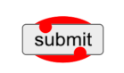
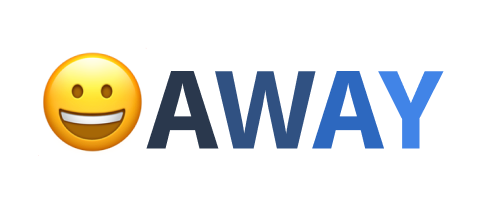

# Canvas Text WICG Proposal

## _Fast Formatted Text for the Web_

This doc: https://github.com/Igalia/explainers/tree/canvas-formatted-text/canvas-formatted-text

Author: Fernando Serboncini and Stephen Chenney

Last Modified: April 25, 2024

Status: In review

Other public docs: [MSEdgeExplainers/FormattedText.md at main](https://github.com/MicrosoftEdge/MSEdgeExplainers/blob/main/Canvas/FormattedText.md), [GitHub - WICG/canvas-formatted-text](https://github.com/WICG/canvas-formatted-text#readme) 

This document groups [use cases](#use-cases) for the Canvas Text WICG and provides high level explainers on the [proposals](#proposals) for each area. The use cases are [Editing](#editing), [Styled and Accessible Text](#styled) and [Text As Art](#art).

# <a name="use-cases"></a> Use Cases

## <a name="editing"></a> 1. Selection and Caret Position for Canvas Text Metrics

Selection and caret position are two building blocks for editing text. Consider the sequence of dragging out a text selection with a mouse or touch, then copying and pasting into a new location. Determining which characters are part of the selection requires mapping a point into a caret position in the text and drawing the selected region requires the selection area. Inserting again requires mapping a point into a location within a character string.

Both selection bounds and caret position are missing from canvas text metrics and must be implemented today using javascript.

We propose additional text metrics to enable editing functionality, specifically: 
* mouse position to character index reverse mapping, allowing authors to determine where a caret should be placed within the string.
* selection box geometry indexed by character range (for instance, see this [Stack Overflow question](https://stackoverflow.com/questions/1451635/how-to-make-canvas-text-selectable))

DOM APIs also provide text measurement functionality. Such functionality should also be available on canvas ```measureText``` and return equivalent values for equivalent strings and styling. ```measureText``` will always be limited to a single style, and therefore has the potential to be much faster (as it doesn’t need layout).

Addressing this use case requires: 
* new metrics APIs
* adequate performance for metrics
* alignment of Canvas ```measureText``` and DOM metrics

Users should be able to interact with canvas-based text input (like Google Docs, VSCode, Miro) in a way that emulates standard DOM content, without developers requiring large javascript solutions.


## <a name="styled"></a> 2. Styled and Accessible Text in Canvas

There’s a strong need for better text support on Canvas. This includes both visual features like multi-line styled text but also the possibility to support the same level of user interaction as the rest of the web (scrolling, interactions, accessibility, indexability, translate, find-in-page, IME input, spellcheck, autofill, etc). Conceptually, this use case has similarity to a mobile WebView within a canvas drawing application.

There are numerous requested features covered by the concept of styled and accessible text:
* Multi-line styled text: Given CSS and text content, render a multi-line paragraph with appropriate styles (such as fonts, ```::first-letter```, borders, text decorations, and so on). The rendered text must be composable with other 2D elements in the canvas.
* Lists, tables, grid and other structured text and image layouts.
* Support for user, browser and bot interrogation of text. Specific actions include translation, find-in-page, spelling checks, crawler indexing, and so on.
* Accessibility improvements, firstly by having the canvas fallback content currently used for accessibility always exactly match the rendered content. Additional benefits include accurate tab navigation and better focus rings. These things currently require considerable author effort to implement with primitive text drawing in canvas.
* Access to live interactive forms, links and editable content with the same quality and security as the web.
* Composing HTML elements with 3D effects.
* Allow HTML rendering in 3D contexts (XR).

In summary, users should be able to read multi-line text in canvas that provides correct i18n, a11y and all other capabilities usually expected from web content.


## <a name="art"></a> 3. Text as Art

In recent years we’ve seen increased demand for better text animation and control in canvas. 

Those use cases include:
* The ability to control how individual graphemes are rendered (over a path or as part of an animation, for example)
* Manipulation of a glyph’s path (text effects, shaping, etc...).
* Native support for i18n and BiDi.

Users should be able to express advanced artistic/animated text rendered into canvas, comparable to SVG text support.


# <a name="proposals"></a> Proposals and Explainers

## 1. Selection and Caret Position for Canvas Text Metrics

We propose three new functions on the ```TextMetrics``` interface:

```c-like
[Exposed=(Window,Worker)] interface TextMetrics {
  // ... extended from current TextMetrics.
  
  unsigned long caretPositionFromOffset(double offset);
  
  sequence<DOMRectReadOnly> getSelectionRects(unsigned long start, unsigned long end);
  DOMRectReadOnly getActualBoundingBox(unsigned long start, unsigned long end);
};
```
The ```caretPositionFromOffset``` method returns the character offset for the character at the given ```offset``` distance from the start position of the text run (accounting for ```text-align```), in the writing direction.

The other functions operate in character ranges and return bounding boxes relative to the text’s origin (i.e., ```textBaseline```/```textAlign``` is taken into account).

```getSelectionRects()``` returns the set of rectangles that the UA would render as the selection background when a particular character range is selected.

```getActualBoundingBox()``` returns the equivalent to ```TextMetric.actualBoundingBox``` restricted to the given range. That is, the bounding rectangle for the drawing of that range. Notice that this can be (and usually is) different from the selection rect, as the latter is about the flow and advance of the text. A font that is particularly slanted or whose accents go beyond the flow of text will have a different paint bounding box. For example: if you select this W, _W_, you may see that the end of the W is outside the selection area, which would be covered by the paint (actual bounding box) area.


### Example usage
```javascript
const canvas = document.getElementById("c");
const ctx = canvas.getContext("2d");

const tm = ctx.measureText("let's do this");
ctx.fillStyle = "red";
const box_for_second_word = tm.getActualBoundingBox(6, 8);
ctx.fillRect(box_for_second_word.x, box_for_second_word.y,
.width, box_for_second_word.height);
const selection_for_third_word = tm.getSelectionRects(9, 13);
ctx.fillStyle = "blue";
for (const s of selection_for_third_word) ctx.fillRect(s.x, s.y, s.width, s.height);
ctx.fillStyle = "black";
ctx.fillText("let's do this");
```
outputs


### Alternatives & Open Questions
* Return a pre-calculated map of ranges?
* Is ```caretPositionForOffset``` needed? Can it be devised from ```getSelectionRects```? Yes and no. Without a dedicated function you would need to get the nound for each character and iterate to find out which one contained the offset (binary search). You could polyfill it though.


## 2. HTML in canvas: placeElement

A fundamental capability missing from the web is the ability to complement Canvas with HTML elements. Adding this capability will enable Canvas surfaces to benefit from all of the styling, layout and behaviors of HTML, including interactive elements and built-in accessibility.

```c-like
interface mixin CanvasElements {
  undefined placeElement(HTMLElement el, double x, double y, optional DomString origin);
}

CanvasRenderingContext2D includes CanvasElements;
```
The ```placeElement(el, x, y, origin)``` function composites an ```HTMLElement``` (together with its subtree) that is a DOM child of the current Canvas into the canvas (using the CTM and filters). ```placeElement``` also determines the rendering order of the element (in relation to the rest of the canvas operations). 

The ```x``` and ```y``` values give the canvas position of the ```origin``` of the element ```el```, where the origin is a string such as ```top-left``` or ```left-baseline```. The ```origin``` is proposed to simplify alignment of multiple placed elements by choosing a common reference point that captures that captures the desired aligned (such as aligning the baselines of the first row of text in each element, or centering elements about a common axis).

The child elements of Canvas don’t impact the overall document layout and, before ```placeElement``` is invoked for the element, are considered "sleeping", or ```display: none```. 

After a child element is placed (and until the canvas is reset), it is considered “alive” and responds to all regular events and user interactions. The element gets repainted (together with the canvas) as needed. It supports all regular events, including form submission, click, text selection, find-in-page, inner scrolling, tab-order, etc...

In other words, when ```placeElement``` is called on an element it becomes part of the document layout (although isolated from the rest of the document), and has CSS applied and executing script. The containing block and other layout context comes from the canvas element itself.

Note: What about viewport-relative CSS units?

Note: Currently child elements of the canvas are fallbacks used to provide accessibility support (the chidren should somehow describe the canvas content when processed by assistive technologies). Though needs to go into how to correctly retain this model for non-```placeElement``` content while also incorprating the placed content.

Note: Does this mean we can only place direct children of the canvas element? What if the same element is placed more than once? Does the first placement disappear? How are element references in JS handled in this situation? 

When the parent Canvas is reset, the browser is allowed to put the placed elements “back to sleep” as they were before.

A canvas is automatically tainted when an element is placed (the same as when it receives non-same-origin content), which prevents all read back functions (```getImageData```, ```toBlob```, ```toDataURL```, etc..) in order to prevent the application reading sensitive user content.

There are some HTML elements and behaviors that may be complex to initially support on this model, such as videos, animated GIFs, composited CSS animations, and cross-process iframes. They will be addressed in a follow up proposal.

We also propose to limit this functionality to ```HTMLCanvasElement``` for now (and hence not allow it on OffscreenCanvas and WebWorkers). Some of those limitations may be lifted in the future.


### Example usage

```javascript
const canvas = document.getElementById("c");
const ctx = canvas.getContext("2d");

const submit = document.createElement("button");
submit.innerHTML = "submit";
submit.style.width = "55px";
submit.style.height = "21px";
canvas.appendChild(submit);
submit.addEventListener("click", ev => console.log("clicked"));

ctx.fillStyle = "red";
ctx.beginPath(); ctx.ellipse(20, 13, 53, 33, 0, 2 * Math.PI); ctx.fill();
ctx.placeElement(submit, 46, 28);
ctx.beginPath(); ctx.arc(30, 16, 4.5, 0, 2 * Math.PI); ctx.fill();
ctx.beginPath(); ctx.arc(54, 34, 4.5, 0, 2 * Math.PI); ctx.fill();
```
outputs

.


Note that the submit button just works:
* The user can click on it to submit the form
* It renders affordances indicating whether it is being clicked
* It can be focused and show a focus ring
* It is available to accessibility APIs

### The next step: drawElement

The current proposal limits ```placeElement``` to Canvas2D, since it’s the only context where we can still keep track of the "final" position of an element on a 2D page. There are dozens of very important use cases that depend on similar functionality for 3D contexts (WebGL/WebGPU/).

The need for support in workers and 3D contexts suggests a method for treating HTML content more like a generated image. The ```drawElement()``` function is similar to ```placeElement()``` but it does not keep the element alive. Instead, the element is painted immediately on the canvas without any follow up. ```drawElement()``` would be easier to integrate into 3D APIs such as WebGPU and WebGL, support use cases such as drawing the same element multiple times, and allow for transferring images to a worker to be rendered async.

The ```drawElement``` function addresses static HTML content but requires additional support for funtionality like event propogation (such as mouse clicks) and invalidation on changes to the DOM. Responsibility for handling user actions and repaints would fall to the page’s JS (repainting on rAF, for example), and propagating user interactions.

The insertion of HTML content that does not taint the canvas is an important use case, and ```drawElement``` may be a simpler framework for non-tainting because the content is not alive (no spell checking or autofill, for example). Such a security model is also a pre-requisite for use in 3D contexts.

## 3. Text as Art

We propose supporting the ability to render minimal grapheme clusters.

```c-like
[Exposed=(Window,Worker)] interface TextMetrics {
  // ... extended from current TextMetrics.
  
  RenderingCluster getTextRenderForRange(unsigned long start, unsigned long end);
};

interface RenderingCluster {
  readonly attribute double x;
  readonly attribute double y;
  readonly attribute long begin;
  readonly attribute long end; 
}
```

This function would return the text rendering operation needed to identically reproduce the original text, broken down as much as the UA is able to (for example, keeping ligatures or NZJ emojis together) that fully includes the interval passed. This means that:

```javascript
const canvas = document.getElementById("c");
const ctx = canvas.getContext("2d");

const text = "😀AWAY";
ctx.font = "800 20px Arial";
const tm = ctx.measureText(text);

let pos = 0;
while (pos < text.length) {
  const rc = tm.getTextRenderForRange(pos, pos + 1);
  ctx.fillStyle = `hsl(216, ${77 * pos / text.length}, ${58 * pos/ length})`;
  ctx.fillText(text.substring(rc.begin, rc.end), rc.x, rc.y);
  // we try to render one char, but that may not always be possible.
  pos = rc.end;
}
```

outputs

.

### Follow up proposals

Additional features for "Text as Art" might include better path control and manipulation on the web (border selection, path operations, inspection and manipulation, etc...), and better Font rendering to Path translations, and better font/shaping information.

