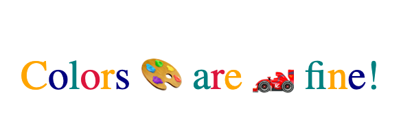

# Canvas Text Metrics for Editing, Art and Design

## <a name="editing-use-cases"></a> Editing Use Cases: Selection and Caret Position for Canvas Text Metrics

Selection and caret position are two building blocks for editing text. Consider the sequence of dragging out a text selection with a mouse or touch, then copying and pasting into a new location. Determining which characters are part of the selection requires mapping a point onto a string, then to a caret position in the text. Drawing the selected region requires the selection area. Inserting again requires mapping a point into a location within a character string.

Both selection bounds and caret position are missing from canvas text metrics and must be implemented today using javascript. Users should be able to interact with canvas-based text input (like Google Docs, VSCode, Miro) in a way that emulates standard DOM content, without developers requiring large javascript solutions.

We propose additional text metrics to enable editing functionality, specifically:
* bounding box for a range, to support hit testing against a sub-range
* mouse position to character index reverse mapping, allowing authors to determine where a caret should be placed within the string.
* selection box geometry indexed by character range (for instance, see this [Stack Overflow question](https://stackoverflow.com/questions/1451635/how-to-make-canvas-text-selectable))

DOM APIs already provide similar functionality, and canvas `measureText` should return equivalent values for equivalent strings and styling to the maximum extent possible. `measureText` will always be limited to a single styled string, and therefore has the potential to be much faster (as it doesn’t need layout).

## <a name="design-use-cases"></a>Uses for Text in Art and Design

In recent years we’ve seen increased demand for better text animation and control in canvas. Of particular concern are text strings where the mapping from character positions to rendered characters is complex or not known at the time of authoring due to font localization.

The use cases include:
* The ability to control how individual graphemes are rendered (over a path or as part of an animation, for example). Consider a case of having text trace the outline of a logo, or letters animating to come together for a word.
* Manipulation of a glyph’s path (text effects, shaping, etc...). Individual characters may be colored diffferently, or custom shaping maybe needed to integrate into a scene.
* Native support for i18n and BiDi layout.

Users should be able to express advanced artistic/animated text rendered into canvas, in a wide array of fonts and languages, comparable to SVG text support.

# <a name="proposal"></a>Proposal: Enhanced Canvas Text Metrics

We propose four new functions on the ```TextMetrics``` interface:

```webidl
dictionary TextAnchorPoint {
  DOMString align;
  DOMString baseline;
};

[Exposed=(Window,Worker)]
interface TextCluster {
    attribute double x;
    attribute double y;
    readonly attribute unsigned long begin;
    readonly attribute unsigned long end;
    readonly attribute DOMString align;
    readonly attribute DOMString baseline;
};

[Exposed=(Window,Worker)] interface TextMetrics {
  // ... extended from current TextMetrics.
  
  unsigned long caretPositionFromPoint(double offset);
  
  sequence<DOMRectReadOnly> getSelectionRects(unsigned long start, unsigned long end);
  DOMRectReadOnly getActualBoundingBox(unsigned long start, unsigned long end);

  sequence<TextCluster> getTextClusters(unsigned long start, unsigned long end, optional TextAnchorPoint anchor_point);
};
```
In addition, a new method on `CanvasRenderingContext2D` supports filling grapheme clusters:
```webidl
interface CanvasRenderingContext2D {
    // ... extended from current CanvasRenderingContext2D.

    void fillTextCluster(TextCluster textCluster, double x, double y);
};
```
The `caretPositionFromPoint` method returns the character offset for the character at the given `offset` distance from the start position of the text run (accounting for `textAlign` and `textBaseline`) with offset always increasing
left to right (so negative offsets are valid). Values to the left or right of the text bounds will return 0 or
`num_characters` depending on the writing direction. The functionality is similar but not identical to [`document.caretPositionFromPoint`](https://developer.mozilla.org/en-US/docs/Web/API/Document/caretPositionFromPoint). In particular, there is no need to return the element containing the caret and offsets beyond the boundaries of the string are acceptable.

The other functions operate in character ranges and return bounding boxes relative to the text’s origin (i.e., `textBaseline`/`textAlign` is taken into account).

`getSelectionRects()` returns the set of rectangles that the UA would render as the selection background when a particular character range is selected.

`getActualBoundingBox()` returns the equivalent to `TextMetric.actualBoundingBox` restricted to the given range. That is, the bounding rectangle for the drawing of that range. Notice that this can be (and usually is) different from the selection rect, as the latter is about the flow and advance of the text. A font that is particularly slanted or whose accents go beyond the flow of text will have a different paint bounding box. For example: if you select this: ***W*** you may see that the end of the W is outside the selection highlight, which would be covered by the paint (actual bounding box) area.

`getTextClusters()` provides the ability to render minimal grapheme clusters (in conjunction with a new method for the canvas rendering context, more on that later). That is, for the character range given as in input, it returns the minimal logical units of text, each of which can be rendered, along with their corresponding positional data. The position is calculated with the original anchor point for the text as reference, while the `text_align` and `text_baseline` parameters determine the desired alignment of each cluster.

To render these clusters on the screen, a new method for the rendering context is proposed: `fillTextCluster()`. It renders the cluster with the `text_align` and `text_baseline` stored in the object, ignoring the values set in the context. Additionally, to guarantee that the rendered cluster is accurate with the measured text, the rest of the `CanvasTextDrawingStyles` must be applied as they were when `ctx.measureText()` was called, regardless of any changes in these values on the context since. Note that to guarantee that the shaping of each cluster is indeed the same as it was when measured, it's necessary to use the whole string as context when rendering each cluster. 

For `text_align` specifically, the position is calculated in regards of the advance of said grapheme cluster in the text. For example: if the `text_align` passed to the function is `center`, for the letter **T** in the string **Test**, the position returned will be not exactly be in the middle of the **T**. This is because the advance is reduced by the kerning between the first two letters, making it less than the width of a **T** rendered on its own.

### Bounding Boxes Example

```javascript
const canvas = document.getElementById("c");
const ctx = canvas.getContext("2d");

const tm = ctx.measureText("let's do this");
ctx.fillStyle = "red";
const box_for_second_word = tm.getActualBoundingBox(6, 8);
ctx.fillRect(
      box_for_second_word.x,
      box_for_second_word.y,
      boxForSecondWord.width,
      box_for_second_word.height);
const selection_for_third_word = tm.getSelectionRects(9, 13);
ctx.fillStyle = "lightblue";
for (const s of selection_for_third_word) {
  ctx.fillRect(s.x, s.y, s.width, s.height);
}
ctx.fillStyle = "black";
ctx.fillText("let's do this");
```
Expected output:


`getSelectionRects()` and `getActualBoundingBox()` can be used on Chrome Canary (starting from version `127.0.6483.0` and `128.0.6573.0` respectively) by enabling the feature with `--enable-features=ExtendedTextMetrics` (or the general `--enable-experimental-web-platform-features`). `caretPositionFromPoint()` is available in Chrome Canary from version `128.0.6587.0`.

### Text Cluster Example:

```javascript
const canvas = document.getElementById('canvas');
const ctx = canvas.getContext('2d');

ctx.font = '60px serif';
ctx.textAlign = 'left';
ctx.textBaseline = 'middle';

const text = 'Colors 🎨 are 🏎️ fine!';
let tm = ctx.measureText(text);
let clusters = tm.getTextClustersForRange(0, text.length,
                                         {align: 'left', 
                                          baseline: 'middle'});

const colors = ['orange', 'navy', 'teal', 'crimson'];
for(let cluster of clusters) {
    ctx.fillStyle = colors[cluster.begin % colors.length];
    ctx.fillTextCluster(cluster, 0, 0);
}
```
Expected output:

.

### Editing Example

An toy text editor making use of these features is available at https://blogs.igalia.com/schenney/html/editing-canvas-demo.html
