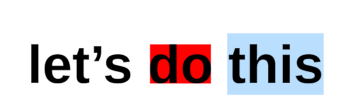

# Canvas Text Metrics for Editing

## <a name="use-cases"></a> Editing Use Cases: Selection and Caret Position for Canvas Text Metrics

Selection and caret position are two building blocks for editing text. Consider the sequence of dragging out a text selection with a mouse or touch, then copying and pasting into a new location. Determining which characters are part of the selection requires mapping a point onto a string, then to a caret position in the text. Drawing the selected region requires the selection area. Inserting again requires mapping a point into a location within a character string.

Both selection bounds and caret position are missing from canvas text metrics and must be implemented today using javascript. Users should be able to interact with canvas-based text input (like Google Docs, VSCode, Miro) in a way that emulates standard DOM content, without developers requiring large javascript solutions.

We propose additional text metrics to enable editing functionality, specifically:
* bounding box for a range, to support hit testing against a sub-range
* mouse position to character index reverse mapping, allowing authors to determine where a caret should be placed within the string.
* selection box geometry indexed by character range (for instance, see this [Stack Overflow question](https://stackoverflow.com/questions/1451635/how-to-make-canvas-text-selectable))

DOM APIs already provide similar functionality, and canvas `measureText` should return equivalent values for equivalent strings and styling to the maximum extent possible. `measureText` will always be limited to a single styled string, and therefore has the potential to be much faster (as it doesn’t need layout).

# <a name="proposal"></a>Proposal: Selection and Caret Position for Canvas Text Metrics

We propose three new functions on the ```TextMetrics``` interface:

```javascript
[Exposed=(Window,Worker)] interface TextMetrics {
  // ... extended from current TextMetrics.
  
  unsigned long caretPositionFromPoint(double offset);
  
  sequence<DOMRectReadOnly> getSelectionRects(unsigned long start, unsigned long end);
  DOMRectReadOnly getActualBoundingBox(unsigned long start, unsigned long end);
};
```
The `caretPositionFromPoint` method returns the character offset for the character at the given `offset` distance from the start position of the text run (accounting for `textAlign` and `textBaseline`) with offset always increasing
left to right (so negative offsets are valid). Values to the left or right of the text bounds will return 0 or
`num_characters` depending on the writing direction. The functionality is similar but not identical to [`document.caretPositionFromPoint`](https://developer.mozilla.org/en-US/docs/Web/API/Document/caretPositionFromPoint). In particular, there is no need to return the element containing the caret and offsets beyond the boundaries of the string are acceptable.

The other functions operate in character ranges and return bounding boxes relative to the text’s origin (i.e., `textBaseline`/`textAlign` is taken into account).

`getSelectionRects()` returns the set of rectangles that the UA would render as the selection background when a particular character range is selected.

`getActualBoundingBox()` returns the equivalent to `TextMetric.actualBoundingBox` restricted to the given range. That is, the bounding rectangle for the drawing of that range. Notice that this can be (and usually is) different from the selection rect, as the latter is about the flow and advance of the text. A font that is particularly slanted or whose accents go beyond the flow of text will have a different paint bounding box.


### Example usage
```javascript
const canvas = document.getElementById("c");
const ctx = canvas.getContext("2d");

const tm = ctx.measureText("let's do this");
ctx.fillStyle = "red";
const box_for_second_word = tm.getActualBoundingBox(6, 8);
ctx.fillRect(box_for_second_word.x, box_for_second_word.y,
.width, box_for_second_word.height);
const selection_for_third_word = tm.getSelectionRects(9, 13);
ctx.fillStyle = "blue";
for (const s of selection_for_third_word) ctx.fillRect(s.x, s.y, s.width, s.height);
ctx.fillStyle = "black";
ctx.fillText("let's do this");
```
outputs



