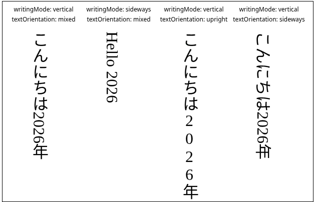
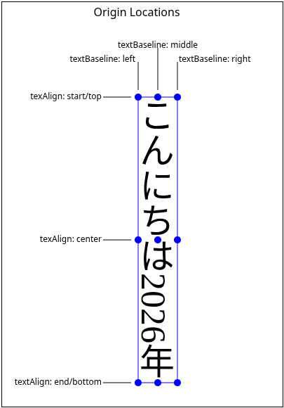

# Canvas Text Writing Mode Support

## Authors:

- Stephen Chenney (Igalia)

## Participate
- https://github.com/whatwg/html/issues/11449
- WHATNOT Meetings

## Introduction

We propose the addiiton of writing mode attributes for HTML canvas text
rendering. Writing mode is important for correct internationalization of
web content and browsers currently are not interoparable in their handling
of the CSS writing mode properties on canvas content. Borrowing the
writing mode terminology and behavior from CSS will greatly simplify
vertical text rendering for canvas, while offering a model that developers may
already be familiar with.

## User-Facing Problem

Users in regions where non-latin scripts are the norm are currently under-served
by HTML canvas APIs to geenrate text in the appropriate writing mode (such as
vertical, reading left-to-right or right-to-left, with stategies for mixing
latin text). We expect making things easier for developers will make it more likely that the serve all users. Those already trying to implement writing modes in script
will be able to reduce their download size, also benefiting users.

### Goal

A simple approach for generating text strings oriented and shaped for vertical
writing, and algorithms for aligning runs of text when rendering, matching CSS
semantics as much as possible.

### Non-goals

We do not plan to address multi-line text as canvas does not support this even
for horizontal writing.

## Proposed Approach

We propose the addition of two attributes to the HTML `CanvasTextDrawingStyles`
interface:
* `writingMode` to control the orientation of characters and their relative positions
when a text string is shaped. The possible values will be `horizontal` (the default),
`vertical` and  `sideways`.
* `textOrientation` to control the orientation of characters within the line. The
possible values will be `mixed` (the default), `upright` or `sideways`.

A text string shaped with these attributes will match the result of a single line
styled with the corresponding CSS properties.

The `horizontal` `writingMode` value will render the same as current canvas text.

A `writingMode` of `vertical` or `sideways` will produce a string that will render
vertically if not explicitly rotated. That is, the bound will likely be higher than it
is wide. The existing `textAlign` attribute will apply to the _vertical_ position of
the text, chosen to be that way so that the existing `start` and `end` values
for `textAlign` still make sense. We will then allow `top` and `bottom` as additional
values. The `textBaseline` will control _horizontal_ position, but this is more
challenging because most writing system still use vertically oriented characters,
so their baselines are vertical offsets. We will allow only `left`, `right` and
`center`, matching the existing `textAlign` behavior.

### Example

## Alternatives considered

The original PR for adding [canvas text rendering support](https://github.com/whatwg/html/commit/96b43465a8a302fe451bbf550608594415bd08f9)
included `fillVerticaltext` and similar methods, but these were never included
in the final specification. We prefer an attribute driven approach rather than
specialized methods because it allows greater flexibility with fewer additions.
We can add 2 attributes each with a few potential values rather than their cross-product of new methods. Borrowing CSS terminology also aids in developer
familiarity and eases the use of existing browser code for implementation.

An alternative for `textAlign` and `textBaseline` is to use the horizontal writing mode values, with `textAlign` controlling horizontal position and `textBaseline` controlling vertical. This may be simpler for authors to remember, even though now `start` and `end` would lose their meaning, as would most baseline values.

## Accessibility, Internationalization, Privacy, and Security Considerations

This proposal will make internaitonalization of canvas content easier by enabling
wiriting mode support on par with that offered by CSS. Existing internationalizion
requires custom solutions to achieve high quality vertical writing across browsers.
This in turn will help users as we would expect greater utilization of localized
writing modes when it is easier to achieve them.

This feature will add no additonal personal information or fingerprinting risk beyond
that already available through the CSS features and existing text rendering and metrics.
HTMNL canvas accessibility is unchanged.

## Stakeholder Feedback / Opposition

Pending.

## References & acknowledgements

This proposal was motivated by a comment on the
[TAG review](https://github.com/w3ctag/design-reviews/issues/1095) for Extended Text Metrics.
