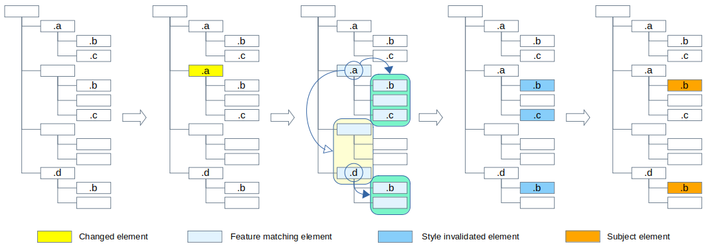

# Blink CSS Style Invalidation

## 1. CSS Style Invalidation?

You can get the simple description of style invalidation from the [Overview section](https://chromium.googlesource.com/chromium/src/+/refs/tags/90.0.4430.54/third_party/blink/renderer/core/css/style-invalidation.md#overview-of-invalidation) of the [CSS Style Invalidation in Blink](https://chromium.googlesource.com/chromium/src/+/refs/tags/90.0.4430.54/third_party/blink/renderer/core/css/style-invalidation.md) document
> Invalidation is the process of marking which elements need their style recalculated in response to a change in the DOM.

## 2. The Style Invalidation and Style Recalculation

`Style Invalidation` and `Style Recalculation` is separated process, and the difference was described in the [invalidation sets design doc](https://goo.gl/3ane6s) as below.
> In the code, there are two passes over the DOM tree which are named Style Invalidation and Style Recalculation. Style Invalidation is the process of applying descendant invalidation sets scheduled for elements down the elements’ subtree and mark elements for Style Recalculation. Style Recalculation then traverses the DOM tree and calculates the computed style (RenderStyle objects) for the marked elements.

In short,
  * `Style Invalidation` is a process to invalidate style of possible subject elements in response to a change
  * `Style Recalculation` is a process to compute styles for those style invalid elements

## 3. Simplest approach - Invalidate everything for every change

As the style invalidation document pointed, the simplest possible approach is to invalidate everything in response to every change.

When we have a style `.a .b { ... }` and a `a` class is added or removed to an element in a DOM tree, the simplest possible approach to handle the change is to get the subject elements from the DOM tree by matching the selector `.a .b` to every elements and apply the style to the subject elements.

## 4. Invalidation sets approach

Instead of invalidating entire tree, the document introduces an invalidation sets approach.
> Invalidation sets give us a way to find a smaller set of elements which need recalculation. They are not perfect, they err on the side of correctness, so we invalidate elements that do not need recalculation but this are significantly better than recalculating everything.

The steps can be conceptually described as below.
(For the details, please refer the documents - [Invalidation sets design doc](https://goo.gl/3ane6s), [Sibling invalidation design doc](https://goo.gl/z0Z9gn) )

**Builds invalidation sets by extracting features from selectors in style rules**

WIP: Need some descriptions

**Turning DOM changes into invalidations with the invalidation sets**

WIP: Need some descriptions

