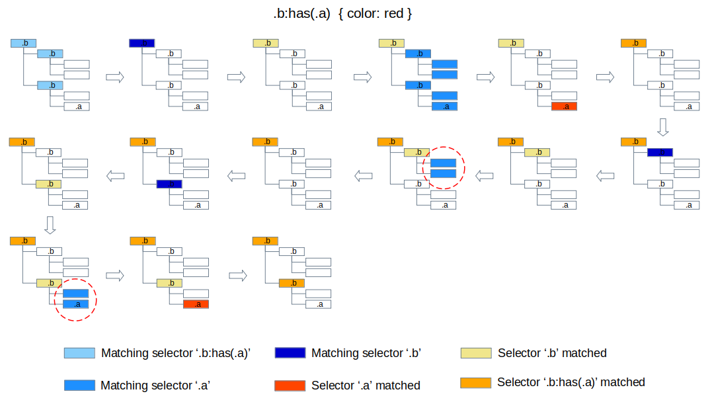

# :has() pseudo class matching

## 1. Matching :has argument to the downward subtree

To determine whether an element matches a `:has()` pseudo class or not, the style engine needs to match the argument of the `:has()` to the downward subtree of the element.

## 2. Repetitive argument matching while style recalculation

During the [style recalculation process](blink-css-style-invalidation.md#2-the-style-invalidation-and-style-recalculation), a selector in a style rule will be matched to the style invalid elements in the DOM to determine whether the style rule need to be applied to the elements to compute styles.

If the selector contains `:has` pseudo class, the `:has()` matching operation can generate a performance issue of repetitive argument matching when a style invalid element contains additional style invalid elements in it's downward subtree.

We can prevent the repetitive argument matching operations by caching the :has matching result. You can get the details from [the previous document](https://docs.google.com/document/d/1pk9rGRoxZ-axaf9OEeQ0Wk7SBebhpC-WUIw1-czmxt0/edit#heading=h.d6oztpar5hb8) about `:has` matching prototyping.

