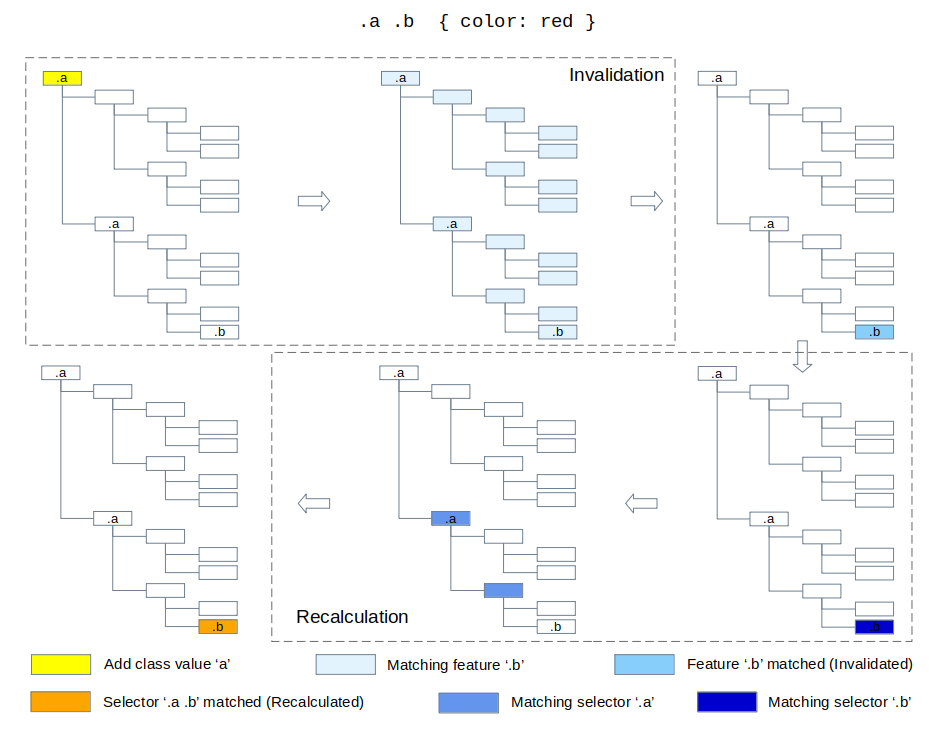
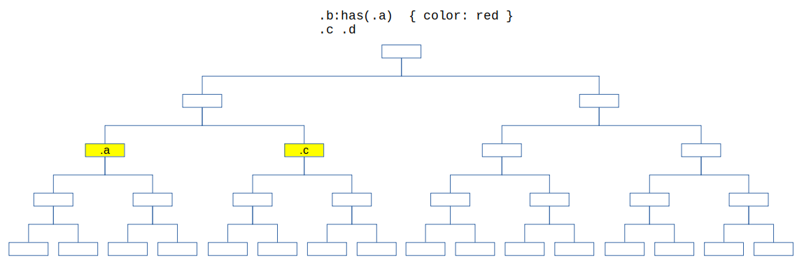
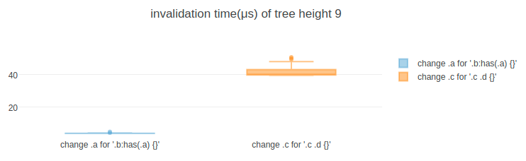
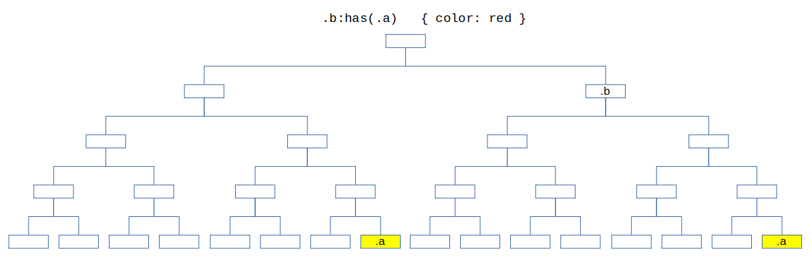
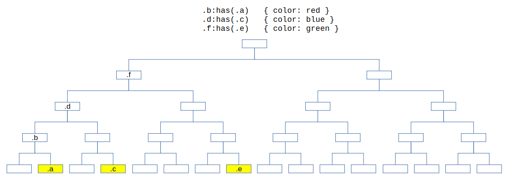
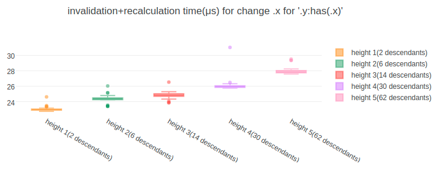
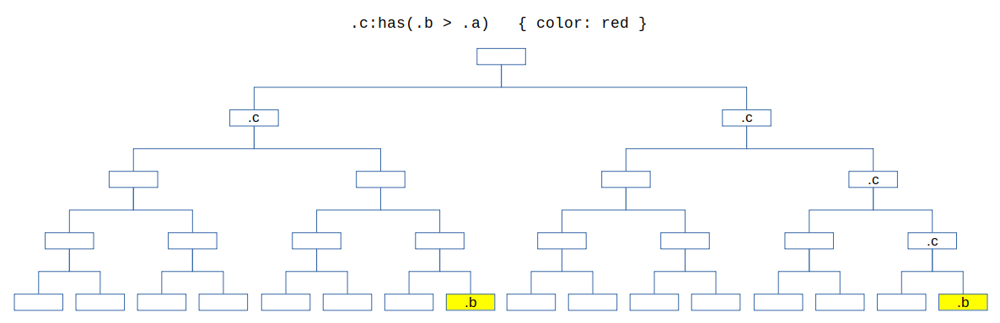
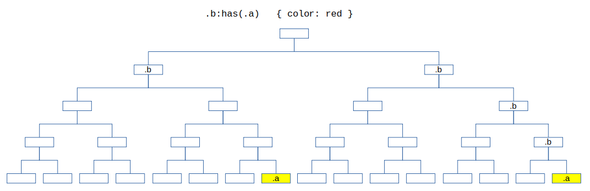

# CSS Style Invalidation with :has()


## 1. Invalidation without :has()

### 1.1. Summary

(Please read the [summary of Blink CSS Style Invalidation](blink-css-style-invalidation.md) for more details)

Current blink style invalidation approach builds invalidation sets from selectors in style rules, and use it in the style invalidation process to mark elements to be recalculated in response to a change in the DOM. 


### 1.2. Inspiration from the approach
The approach provides following advantages.
 * Can find style invalid elements of a changed element with features from selectors in style rule
 * Can skip the upward subtree matching by searching invalid elements from downward subtree
 * Can reduce matching overhead by matching features instead of selectors
 * Can reduce number of elements to be invalidated by matching subject feature
 * Can skip feature matching operations on some downward subtree by separating the sibling invalidation set
 * The invalidation set of a style rule will be built once when the style rule is added
 * The feature matching will be done only when a change can be turned into a feature

We can think about getting those advantages from the invalidation with `:has()` by applying similar approach.


## 2. Invalidation of :has()

### 2.1. Searching invalid elements from upward subtree

The difference between `:has()` invalidation and other selectors' is the direction of the subtree that contains style invalid elements of a change.

As described in the [summary of Blink CSS Style Invalidation](blink-css-style-invalidation.md), invalidation without `:has()` searches style invalid elements of a change from the downward subtree of the changed element because the subject elements are in the downward subtree.

But for the invalidation of `:has()`, we need to get style invalid elements of a change from the opposite direction(upward subtree of the changed element) because the subject elements are in the upward subtree.


We can differenciate thest two types of invalidation as **downward invalidation** and **upward invalidation**.


### 2.2. Upward Invalidation

Because of the subtree difference at above, lots of complex cases can be generated by combining the `:has()` selector with other selectors. To start with the simple problem, we will describe the approach for the single compound selector that contains single `:has()` first. And based on this, we will expand to the various cases to get more details at the [3. Invalidation of various cases with :has()](#3-invalidation-of-various-cases-with-has)

Style invalidation for a compound selector containing `:has()` can be described as below.

**Builds invalidation sets by extracting features from :has compound selectors in style rules**

Similar with the downward invalidation, upward invalidation builds invalidation sets by extracting features and relations from compound selectors and combinators in a style rule.


Instead of building succeeding-sibling invalidation sets and descendant invalidation sets, upward invalidation builds preceding-sibling invalidation sets and ancestor invalidation sets.


**Turning DOM changes into invalidations with the invalidation sets**

We can get style invalid elements from upward subtree with the ancestor invalidations sets and preceding-sibling invalidation sets.

```
 * Get features for the DOM change
 * Create a ancestor_feature_set
 * Create a preceding_feature_set
 * For each feature1 in the features
   * Insert all feature1 preceding sibling invalidation sets to the preceding_feature_set
   * Insert all feature1 ancestor invalidation sets to the ancestor_feature_set
 * If preceding_feature_set is not empty
   * For each preceding sibling element of the changed element
     * For each feature2 in preceding_feature_set
       * Match feature2 to the preceding sibling element
       * If matched
         * Invalidate the preceding sibling element
         * Break iteration to move to the next preceding sibling
 * If ancestor_feature_set is not empty
  * For each ancestor element of the changed element
    * Create a preceding_feature_set
    * For each feature3 in ancestor_feature_set
      * Match feature3 to the ancestor element
      * If matched
        * If feature3 is subject feature
          * Invalidate the ancestor element
        * Insert all feature3 preceding invalidation set to the preceding_feature_set
    * If preceding_feature_set is not empty
      * For each preceding sibling element of the ancestor element
        * For each feature4 in the preceding_feature_set
          * Match feature4 to the preceding sibling element
          * If matched
            * Invalidate the preceding sibling element
            * Break iteration to move to the next preceding sibling
```


### 2.3 Taking similar advantages

The approach provides similar advantages.
 * Can find style invalid elements of a changed element with features from selectors in style rule
 * Can skip the downward subtree matching by searching invalid elements from upward subtree
 * Can reduce matching overhead by matching features instead of selectors
 * Can reduce number of elements to be invalidated by matching subject feature
 * Can skip feature matching operations on some upward subtree by separating the sibling invalidation set
 * The invalidation set of a style rule will be built once when the style rule is added
 * The feature matching will be done only when a change can be turned into a feature


### 2.4. Simple Feature and Compound Feature

To determine whether an element is a subject element, normally the style engine matches compound selectors from the element to the upward. For example, when we have a selector `.b > .a` and an style invalidated element, style engine matches the `.a` first to the element, and matches the `.b` later to the parent of the element.

But the `:has` requires additional downward subtree traversal before matching the argument. For example, when we have a selector `.c:has(.b > .a)` and an style invalid element, style engine traverse descendants of the element, and do the matching operations of `.b > .a` (upward matching as described above) on each descendant element.

The style recalculation of `:has()` is heavier operation because argument selector matching operation will be done on the descendant elements of a style invalid element. So finding a way to get the smaller number of style invalid elements from the style invalidation process will be helpful for the performance.

The simple way to do this is to extract a compound feature (combinations of simple features) from a compound selector and build invalidation set with the compound feature.


To convert a change to compound features, we can build additional map to index simple feature to compound features.


As a result, from style rules, we can get simple to compound maps and invalidation sets


The invalidation steps will be changed as below.

```diff
- * Get features for the DOM change
+ * Get simple_features for the DOM change
  * Create a ancestor_feature_set
  * Create a preceding_feature_set
- * For each feature1 in the features
+ * For each simple_feature in the simple_features
+   * Get compound_features from simple_to_compound_map
+   * For each feature1 in compound_features
+     * Match feature1 to the changed element
+     * If matches
        * Insert all feature1 preceding sibling invalidation sets to the preceding_feature_set
        * Insert all feature1 ancestor invalidation sets to the ancestor_feature_set
```

In the above changes, a compound feature matching step (`Match feature1 to the changed element`) was added. This can be a trade-off because we need to match compound features to skip unnecessary invalidation, but also matching compound features for every changes can have a negative impact on performance. To handle this, we can think about a way to skip matching simple features those are from the change. This can be described with more details. So it will be handeld in the [prototyping details](prototyping-details.md)


### 2.5. Minimize dependencies

Current blink style invalidation covers downward invalidation cases with highly optimized designs and implementations. The [style_invalidator.cc](https://chromium.googlesource.com/chromium/src/+/refs/tags/90.0.4430.54/third_party/blink/renderer/core/css/invalidation/style_invalidator.cc) starts with below comments.

> StyleInvalidator methods are super sensitive to performance benchmarks. We easily get 1% regression per additional if statement on recursive invalidate methods.

If the upward invalidation approach depends on the designs and implementations of the current invalidation approach and requires any modification of the current implementation, it is clear that it causes regressions.

The problem becomes more serious in the context of the browser compatibility. If the upward invalidation approach tightly depends on the current Blink invalidation logic, it would be hard or impossible to apply the approach to the other browser engines.

The upward invalidation approach for `:has()` is inspired from the current Blink invalidation approach. It takes high-level concepts and idea of the current approach - extracting features and relations, build invalidation sets and invalidate with those.

But fortunately, the detail design and implementation of the upward invalidation are different with those of the downward invalidation because of the different subtree and traversal direction. It means, to minimize dependencies, we can split those two implementations. (Actually, it is more difficult to reuse the current implementation to the upward invalidation)

In the perspective of interfacing, we can limit dependencies by defining interfaces. The upward invalidation approach for `:has()` depends on these.
 * the selector data structure (to extract features and build invalidatoin set)
 * the DOM tree/element data structure (to tree traversal and feature matching)
 * the method to trigger style recalculation of an element (to invalidate the element)


## 3. Invalidation of various cases with :has()

Upward invalidation is not enough to handle various cases with `:has` selector. (e.g. none-terminal `:has`, `:is` in `:has`, ...) To handle all those cases, downward invalidation should be done before or after an upward invalidation. Because of this, it seems to be inevitable to have un-acceptable complexities by creating tight dependencies on the downward invalidation implementation or by adding additional downward invalidation only for `:has` which fully covers all the optimizations.

But as the original approach described, the purpose of the approach is not providing the perfect optimal solutions for every cases but providing sub-optimal solutions those are better then the worst solutions.

Based on this view point, we can think about solutions for the complicated cases without creating tight dependencies or having a copy of the downward solutions. The following sections will describe those with more details.


### 3.1. Change variations
// WIP

#### 3.1.1. Changes on existing elements in a DOM
// WIP

#### 3.1.2. Add an element or a subtree to a DOM
// WIP

#### 3.1.3. Remove an element or a subtree from a DOM
// WIP

### 3.2. Feature matching variations
// WIP

#### 3.2.1. tag/id/class selector
// WIP

#### 3.2.2. Attribute selector
// WIP

#### 3.2.3. :hover pseudo class
// WIP

#### 3.2.4. ...
// WIP

### 3.3. Subtree traversal variations
// WIP

#### 3.3.2. none-terminal :has
// WIP

#### 3.3.3. terminal :has(:has)
// WIP

#### 3.3.3. terminal :has(:is)
// WIP

#### 3.3.4. terminal :has(:is(:has))
// WIP

#### 3.3.5. none-terminal :has(:is)
// WIP

## 4. Performance factors

When we check the performance of the `:has` invalidation, we usually check entire invalidation process and this includes style recalculation process also.


Dividing the style process into the two processes (Style Invalidation / Style Recalculation) is also helpful to get simple and clear understanding about the performance factors of the `:has()` invalidation approach.

Invalidation process is a process to get style invalid element by matching features for a change. The performance of the feature matching operation is the key of the invalidation performance. If we need to focus to the operation, we can check the performance of the invalidation process with a change that doesn't have any style invalid element.


Recalculation process is a process to get subject element by matching selector to the style invalid element. The performance of the argument selector matching operation is the key of the recalculation performance. If we need to focus to the operation, we can check the performance of the recalculation process with a change that has style invalid elements but doesn't have any subject element.


For the simple and clear understanding, we will check style invalidation and style recalculation of a compound selector that contains single `:has`. Performance factors for the complex cases will be handled after those.

### 4.1. Understanding the subtree direction

Compared to `:has()`, normal style invalidation and recalculation has different invalidation direction(downward invalidation) and it doesn't need to traverse downward subtree in the recalculation process.


All the complexities about `:has()` are comming from these differences.
|               |                 .b:has(.a)                   |                .a .b                |
| ------------- | -------------------------------------------- | ----------------------------------- |
| Invalidation  | Upward subtree of changed element            | Downward subtree of changed element |
| Recalculation | Invalidated element and its downward subtree | Invalidated element                 |

Before breaking down the `:has()` performance factors on each process (invalidation/recalculation), comparing performances related with those differences would be helpful to get clear understanding about the subtree direction.

 * Invalidation difference
 * Recalculation difference
 * :has Invalidation and Recalculation

#### 4.1.1. Invalidation difference


For a same change type at a same level of a DOM tree, the upward invalidation process performs better than the downward invalidation process because of the subtree size.

**Invalidation time (μs)**



Test link : https://css-has.glitch.me/performance-factor-invalidation-difference.html

#### 4.1.2. Recalculation difference


For a same change type at a same level of a DOM tree, the `:has()` recalculation process performs worse than the normal recalculation process because of the `:has()` matching logic that requires subtree traversal.

**Recalculation time (μs)**


Test link : https://css-has.glitch.me/performance-factor-recalculation-difference.html

#### 4.1.3. :has Invalidation and Recalculation


For a same change type at a same level of a DOM tree, the `:has()` recalculation overhead is heavier than the invalidation overhead because of the subtree direction of invalidation and recalculation.

**:has Invalidation/Recalculation time (μs)**


Test link : https://css-has.glitch.me/performance-factor-has-invalidation-and-recalculation.html


### 4.2. :has Style Invalidation
In the style invalidation process, style-engine get features for the change, and invalidate elements in upward subtree of the changed element with invalidation sets. These are factors that can affect performance of a style invalidation.

 * Depth of the changed element
 * Number of subject features
 * Number of simple features in a subject features
 * Number of simple features in a feature for the change
 * Matching operation of a simple feature in a subject feature
 * Matching operation of a simple feature in a feature for the change
 * Number of partial attribute features for an attribute name of the attribute change

#### 4.2.1. Depth of the changed element


**Invalidation time (μs)**


Test link: https://css-has.glitch.me/performance-factor-depth-of-the-changed-element.html

#### 4.2.2. Number of subject features


**Invalidation time (μs)**


Test link: https://css-has.glitch.me/performance-factor-number-of-subject-features.html

#### 4.2.3. Number of simple features in a subject feature


**Invalidation time(μs)**


Test link: https://css-has.glitch.me/performance-factor-number-of-simple-features-in-a-subject-feature.html

#### 4.2.4. Number of simple features in a feature for the change


**Invalidation time(μs)**


Test link: https://css-has.glitch.me/performance-factor-number-of-simple-features-in-a-feature-for-the-change.html

#### 4.2.5. Matching operation of a simple feature in a subject feature


#### 4.2.6. Matching operation of a simple feature in a feature for the change


#### 4.2.7. Number of partial attribute features for an attribute name of the attribute change


### 4.3. :has Style Recalculation

In the style recalculation process, style engine matches `:has` argument selectors to descendent elements of a style invalid element to determine whether the style invalid element is a subject element or not. (Please refer the [has pseudo class matching](has-pseudo-class-matching.md) to get some details)

These are the factors that affect performance of the style recalculation.

 * Descendant tree size of a subject element
 * Position of the first element that matches argument selector
 * Number of invalid/none-subject elements
 * Number of subject elements

We can check those factors as followings.

#### 4.3.1. Descendant tree size of a subject element


**Recalculation time(μs)**



Test link: https://css-has.glitch.me/performance-factor-descendant-tree-size-of-a-subject-element.html

#### 4.3.2. Position of the first element that matches argument selector


**Recalculation time(μs)**


Test link: https://css-has.glitch.me/performance-factor-position-of-the-first-element-that-matches-argument-selector.html

#### 4.3.3. Number of invalid/none-subject elements


**Recalculation time(μs)**


Test link: https://css-has.glitch.me/performance-factor-number-of-invalid-none-subject-elements.html

**Ref. Recalculation time(μs) of '.a .b .c {...}'**


Test link: https://css-has.glitch.me/performance-factor-number-of-invalid-none-subject-elements-without-has.html

#### 4.3.4. Number of subject elements


**Recalculation time(μs)**


Test link: https://css-has.glitch.me/performance-factor-number-of-subject-elements.html

**Ref. Recalculation time(μs) of '.a .b .c {...}'**


Test link: https://css-has.glitch.me/performance-factor-number-of-subject-elements-without-has.html

### 4.4. Complex Cases

// WIP


## 5. Prototyping

Please refer the [prototyping details](prototyping-details.md).
