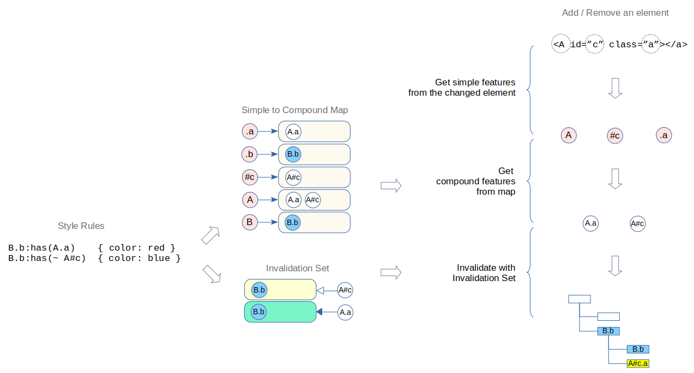
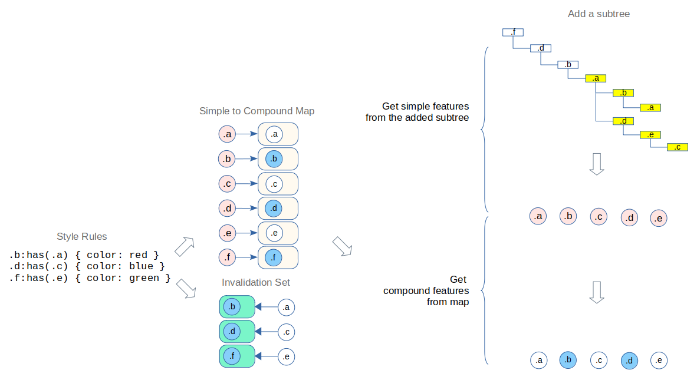
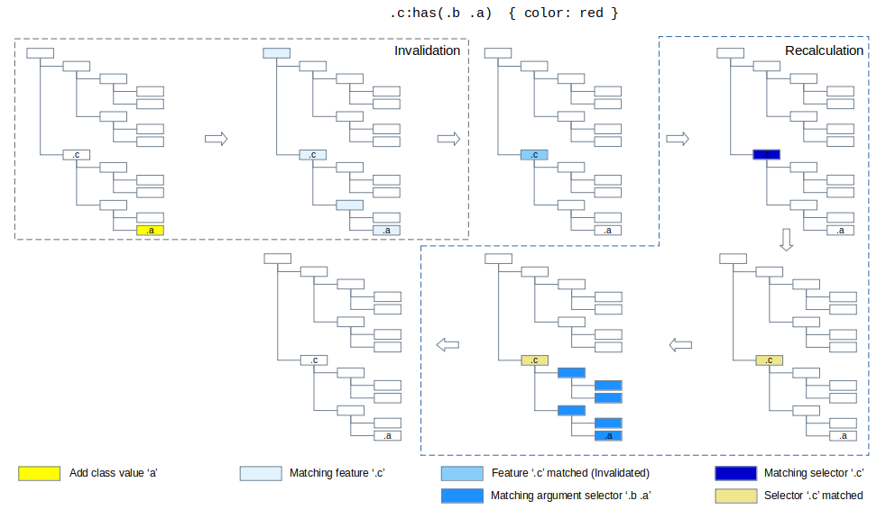
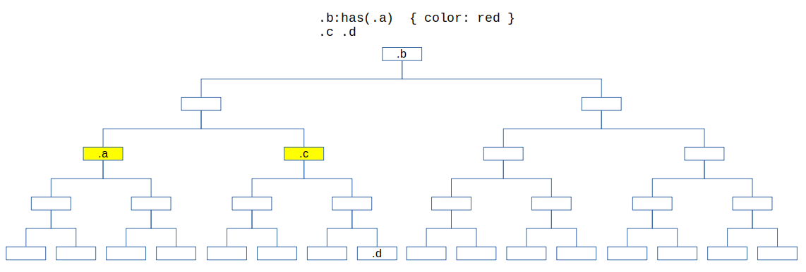
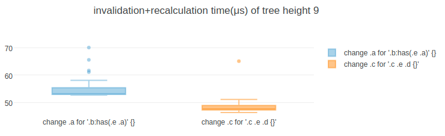
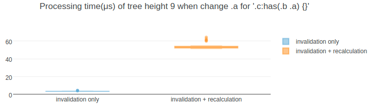
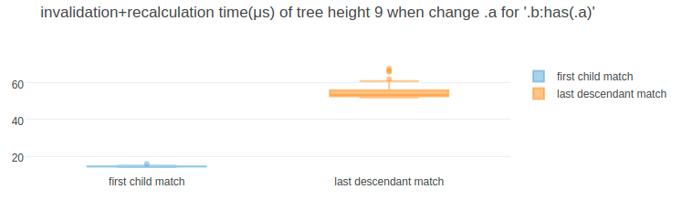
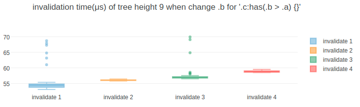
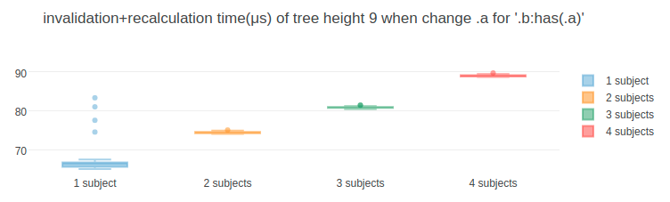

# CSS Style Invalidation with :has()


## 1. Invalidation without :has()

### 1.1. Summary

(Please read the [summary of Blink CSS Style Invalidation](blink-css-style-invalidation.md) for more details)

Current blink style invalidation approach builds invalidation sets from selectors in style rules, and use it in the style invalidation process to mark elements to be recalculated in response to a change in the DOM. 


### 1.2. Inspiration from the approach
The approach provides following advantages.
 * Can find style invalid elements of a changed element with features from selectors in style rule
 * Can skip the upward subtree matching by searching invalid elements from downward subtree
 * Can reduce matching overhead by matching features instead of selectors
 * Can reduce number of elements to be invalidated by matching subject feature
 * Can skip feature matching operations on some downward subtree by separating the sibling invalidation set
 * The invalidation set of a style rule will be built once when the style rule is added
 * The feature matching will be done only when a change can be turned into a feature

We can think about getting those advantages from the invalidation with `:has()` by applying similar approach.


## 2. Invalidation of :has()

### 2.1. Searching invalid elements from upward subtree

The difference between `:has()` invalidation and other selectors' is the direction of the subtree that contains style invalid elements of a change.

As described in the [summary of Blink CSS Style Invalidation](blink-css-style-invalidation.md), invalidation without `:has()` searches style invalid elements of a change from the downward subtree of the changed element because the subject elements are in the downward subtree.

But for the invalidation of `:has()`, we need to get style invalid elements of a change from the opposite direction(upward subtree of the changed element) because the subject elements are in the upward subtree.


We can differenciate thest two types of invalidation as **downward invalidation** and **upward invalidation**.


### 2.2. Upward Invalidation

Because of the subtree difference at above, lots of complex cases can be generated by combining the `:has()` selector with other selectors. To start with the simple problem, we will describe the approach for the single compound selector that contains single `:has()` first. And based on this, we will expand to the various cases to get more details at the [3.3. Subree traversal variations](#33-subtree-traversal-variations)

Style invalidation for a compound selector containing `:has()` can be described as below.

**Builds invalidation sets by extracting features from :has compound selectors in style rules**

Similar with the downward invalidation, upward invalidation builds invalidation sets by extracting features and relations from compound selectors and combinators in a style rule.


Instead of building succeeding-sibling invalidation sets and descendant invalidation sets, upward invalidation builds preceding-sibling invalidation sets and ancestor invalidation sets.


**Turning DOM changes into invalidations with the invalidation sets**

We can get style invalid elements from upward subtree with the ancestor invalidations sets and preceding-sibling invalidation sets.

```
 * Get features for the DOM change
 * Create a ancestor_feature_set
 * Create a preceding_feature_set
 * For each feature1 in the features
   * Insert all feature1 preceding sibling invalidation sets to the preceding_feature_set
   * Insert all feature1 ancestor invalidation sets to the ancestor_feature_set
 * If preceding_feature_set is not empty
   * For each preceding sibling element of the changed element
     * For each feature2 in preceding_feature_set
       * Match feature2 to the preceding sibling element
       * If matched
         * Invalidate the preceding sibling element
         * Break iteration to move to the next preceding sibling
 * If ancestor_feature_set is not empty
  * For each ancestor element of the changed element
    * Create a preceding_feature_set
    * For each feature3 in ancestor_feature_set
      * Match feature3 to the ancestor element
      * If matched
        * If feature3 is subject feature
          * Invalidate the ancestor element
        * Insert all feature3 preceding invalidation set to the preceding_feature_set
    * If preceding_feature_set is not empty
      * For each preceding sibling element of the ancestor element
        * For each feature4 in the preceding_feature_set
          * Match feature4 to the preceding sibling element
          * If matched
            * Invalidate the preceding sibling element
            * Break iteration to move to the next preceding sibling
```


### 2.3 Taking similar advantages

The approach provides similar advantages.
 * Can find style invalid elements of a changed element with features from selectors in style rule
 * Can skip the downward subtree matching by searching invalid elements from upward subtree
 * Can reduce matching overhead by matching features instead of selectors
 * Can reduce number of elements to be invalidated by matching subject feature
 * Can skip feature matching operations on some upward subtree by separating the sibling invalidation set
 * The invalidation set of a style rule will be built once when the style rule is added
 * The feature matching will be done only when a change can be turned into a feature


### 2.4. Simple Feature and Compound Feature

To determine whether an element is a subject element, normally the style engine matches compound selectors from the element to the upward. For example, when we have a selector `.b > .a` and an style invalidated element, style engine matches the `.a` first to the element, and matches the `.b` later to the parent of the element.

But the `:has` requires additional downward subtree traversal before matching the argument. For example, when we have a selector `.c:has(.b > .a)` and an style invalid element, style engine traverse descendants of the element, and do the matching operations of `.b > .a` (upward matching as described above) on each descendant element.

The style recalculation of `:has()` is heavier operation because argument selector matching operation will be done on the descendant elements of a style invalid element. So finding a way to get the smaller number of style invalid elements from the style invalidation process will be helpful for the performance.

The simple way to do this is to extract a compound feature (combinations of simple features) from a compound selector and build invalidation set with the compound feature.


To convert a change to compound features, we can build additional map to index simple feature to compound features.


As a result, from style rules, we can get simple to compound maps and invalidation sets


The invalidation steps will be changed as below.

```diff
- * Get features for the DOM change
+ * Get simple_features for the DOM change
  * Create a ancestor_feature_set
  * Create a preceding_feature_set
- * For each feature1 in the features
+ * For each simple_feature in the simple_features
+   * Get compound_features from simple_to_compound_map
+   * For each feature1 in compound_features
+     * Match feature1 to the changed element
+     * If matches
        * Insert all feature1 preceding sibling invalidation sets to the preceding_feature_set
        * Insert all feature1 ancestor invalidation sets to the ancestor_feature_set
```

In the above changes, a compound feature matching step (`Match feature1 to the changed element`) was added. This can be a trade-off because we need to match compound features to skip unnecessary invalidation, but also matching compound features for every changes can have a negative impact on performance. To handle this, we can think about a way to skip matching simple features those are from the change. This can be described with more details. So it will be handeld in the [prototyping details](prototyping-details.md)


### 2.5. Minimize dependencies

Current blink style invalidation covers downward invalidation cases with highly optimized designs and implementations. The [style_invalidator.cc](https://chromium.googlesource.com/chromium/src/+/refs/tags/90.0.4430.54/third_party/blink/renderer/core/css/invalidation/style_invalidator.cc) starts with below comments.

> StyleInvalidator methods are super sensitive to performance benchmarks. We easily get 1% regression per additional if statement on recursive invalidate methods.

If the upward invalidation approach depends on the designs and implementations of the current invalidation approach and requires any modification of the current implementation, it is clear that it causes regressions.

The problem becomes more serious in the context of the browser compatibility. If the upward invalidation approach tightly depends on the current Blink invalidation logic, it would be hard or impossible to apply the approach to the other browser engines.

The upward invalidation approach for `:has()` is inspired from the current Blink invalidation approach. It takes high-level concepts and idea of the current approach - extracting features and relations, build invalidation sets and invalidate with those.

But fortunately, the detail design and implementation of the upward invalidation are different with those of the downward invalidation because of the different subtree and traversal direction. It means, to minimize dependencies, we can split those two implementations. (Actually, it is more difficult to reuse the current implementation to the upward invalidation)

In the perspective of interfacing, we can limit dependencies by defining interfaces. The upward invalidation approach for `:has()` depends on these.
 * the selector data structure (to extract features and build invalidatoin set)
 * the DOM tree/element data structure (to tree traversal and feature matching)
 * the method to trigger style recalculation of an element (to invalidate the element)


## 3. Invalidation of various cases with :has()

The invalidation process finds the style invalid element (candidate subject elements) for a DOM change. The DOM change can be a DOM structure change (add or remove an element or subtree) or a change on an existing element. We can define this as the DOM change variation point.

`:has()` takes relative selector list as it's argument, so the argument selector can contains almost all kind of simple selectors. And the `:has()` pseudo class itself can be combined with any simple selectors in a compound selector. We extract the simple features from simple selectors in the argument selector or the compound selector that contains the `:has()` selector. And the each simple feature has it's own matching operations. We can define this as the simple feature matching variation point.
 * `*:has(+ div[align="center"] .btn)`
 * `[aria-hidden="false"]:has([href^="https://some.domain/"]:hover)`

Without the `:has()` selector, the invalidation direction is fixed as a downward invalidation. But with a `:has` selector, we need to do the upward invalidation for the argument selector in the `:has()` selector. This means that the `:has()` selector has a fixed invalidation direction for it's argument. Some selectors like `:is` selector have a fixed invalidation direction for it's argument, but the direction is opposite - downward invalidation. By combinding these cases, we can have some cases that requires multiple nesting invalidations having different subtree traversal cases for the invalidation. We can define this as the subtree traversal variation point.
 * `.content:has(#invisible) > p`,
 * `.container:has(:is(.video.checked .comment))`
 * `.container:has(:is(.video.checked .comment:has(.thumbsup)))`

The followings are the variation points about the `:has()` invalidation, and we can simply and clearly understand the complex cases by dividing these cases.
 * DOM change variations
 * Simple feature matching variations 
 * Subtree traversal variations

### 3.1. DOM change variations

A DOM change will be one of these.
 * A change on an existing element
 * Add or remove an element
 * Add or remove a subtree

#### 3.1.1. A change on an existing element

These changes can be turned into one simple feature type. For example, if a class value was added to an element, the change can be turned into a simple feature of the class value. The steps to get the style invalid element with the simple feature was already described in the [2. Invalidation of :has](#2-invalidation-of-has) section.

#### 3.1.2. Add or remove an element

These changes cannot be turned into one simple feature type. But we can get simple features for the change from attributes or pseudo states of the changed element. For example, if an added element has some class values and attributes, then we can get simple features of the class values and the attributes. After getting the simple features, we can do the same invalidation steps : Prepare the invalidation by getting the compound features from the simple-to-compound map, and invalidate with invalidation set.


#### 3.1.3. Add or remove a subtree

In case of add a subtree to a DOM, the subject elements of a style rule with `:has()` selector can be in the subtree.


When we follow the same step above, we need to get the features from the all elements in the subtree instead of a single element.


With the invalidation sets for those features, we need to do the invalidation process for every elements in the subtree.


Instead of getting features and doing upward invalidation for every elements in the subtree, we can reduce the overhead by using the subject feature set.

For the added subtree, we can invalidate the subtree and it's upward subtree with the subject feature set.


For the removed subtree, we can invalidate it's upward subtree with the subject feature set.


### 3.2. Simple feature matching variations
// WIP

#### 3.2.1. tag/id/class selector
// WIP

#### 3.2.2. Attribute selector
// WIP

#### 3.2.3. :hover pseudo class
// WIP

#### 3.2.4. ...
// WIP

### 3.3. Subtree traversal variations

Upward invalidation is not enough to handle various cases with `:has` selector because the subject elements can be everywhere in the DOM when we use`:has()` seletor with other selectors. It can be upward subtree, downward subtree and non-upward/non-downward subtree of the changed element.


To handle all those cases, downward invalidation should be done before or after an upward invalidation. Because of this, it seems to be inevitable to have un-acceptable complexities by creating tight dependencies on the downward invalidation implementation or by adding additional downward invalidation only for `:has` which fully covers all the optimizations.

But as the original approach described, the purpose of the approach is not providing the perfect optimal solutions for every cases but providing sub-optimal solutions those are better then the worst solutions.

In the [3.1.3. Add or remove a subtree](#313-add-or-remove-a-subtree) section, we reduced the overhead from the complex subtree traversal by using the subject feature set. There can be similar or some other possible solutions for the other traversal cases.

Based on this view point, we can think about solutions for the complicated cases without creating tight dependencies or having a copy of the downward solutions. The following sections will describe those with more details.

#### 3.3.2. non-terminal :has

When a `:has()` selector is not in the terminal compound selector, the subject element will be in the downward subtree of the elements that match with the compound selector that contains the `:has()` selector. We can invalidate the subject elements by scheduling downward invalidations for each element that matches the `:has()` compound selector. We can get those elements(elements to be scheduled) from the upward invalidation and features from the non-terminal compound selector containing `:has()` pseudo class.


The downward invalidation logic already provides methods to schedule invalidation. The methods takes target element and values of a change (e.g. class values for a class change). We can get the elements to be scheduled with the scheduling features, and can get the change values from the scheduling features. So what we need to do is just call the scheduling methods when an upward invalidation find elements to be scheduled. There will not be any changes on the downward invalidation logic.


```diff
 ...

 * Create a ancestor_feature_set
 * Create a preceding_feature_set
+* Create scheduling_map<element, feature_set>

 ...

      * Match feature3 to the ancestor element
      * If matched
+       * If feature3 is scheduling feature
+         * Add feature3 to the scheduling_map[ancestor element]
        * If feature3 is subject feature
          * Invalidate the ancestor element

 ...

          * Match feature4 to the preceding sibling element
          * If matched
+           * If feature4 is scheduling feature
+             * Add feature4 to the scheduling_map[preceding sibling element]
            * Invalidate the preceding sibling element

 ...

+* For each <element, feature_set> in scheduling_map
+  * For each feature in feature_set
+    * Schedule downward invalidation for the element
```

#### 3.3.3. terminal :has(:has)

Nested `:has` can be projected to the single `:has` to extract features and relations.
// TODO Need more descriptions and images...


#### 3.3.3. terminal :has(:is)
// TODO Need more descriptions and images...


#### 3.3.4. terminal :has(:is(:has))
// TODO Need more descriptions and images...


#### 3.3.5. non-terminal :has(:is), :has(:is(:has))

// TODO (Similar with non-terminal :has, schedule downward invalidation) Need more descriptions and images...

## 4. Performance factors

When we check the performance of the `:has` invalidation, we usually check entire invalidation process and this includes style recalculation process also.


Dividing the style process into the two processes (Style Invalidation / Style Recalculation) is also helpful to get simple and clear understanding about the performance factors of the `:has()` invalidation approach.

Invalidation process is a process to get style invalid element by matching features for a change. The performance of the feature matching operation is the key of the invalidation performance. If we need to focus to the operation, we can check the performance of the invalidation process with a change that doesn't have any style invalid element.


Recalculation process is a process to get subject element by matching selector to the style invalid element. The performance of the argument selector matching operation is the key of the recalculation performance. If we need to focus to the operation, we can check the performance of the recalculation process with a change that has style invalid elements but doesn't have any subject element.


For the simple and clear understanding, we will check style invalidation and style recalculation of a compound selector that contains single `:has`. Performance factors for the complex cases will be handled after those.

### 4.1. Understanding the subtree direction

Compared to `:has()`, normal style invalidation and recalculation has different invalidation direction(downward invalidation) and it doesn't need to traverse downward subtree in the recalculation process.


All the complexities about `:has()` are comming from these differences.
|               |                 .b:has(.a)                   |                .a .b                |
| ------------- | -------------------------------------------- | ----------------------------------- |
| Invalidation  | Upward subtree of changed element            | Downward subtree of changed element |
| Recalculation | Invalidated element and its downward subtree | Invalidated element                 |

Before breaking down the `:has()` performance factors on each process (invalidation/recalculation), comparing performances related with those differences would be helpful to get clear understanding about the subtree direction.

 * Invalidation difference
 * Recalculation difference
 * :has Invalidation and Recalculation

#### 4.1.1. Invalidation difference


For a same change type at a same level of a DOM tree, the upward invalidation process performs better than the downward invalidation process because of the subtree size.

Test link : https://css-has.glitch.me/performance-factor-invalidation-difference.html

<kbd></kbd>

#### 4.1.2. Recalculation difference


For a same change type at a same level of a DOM tree, the `:has()` recalculation process performs worse than the normal recalculation process because of the `:has()` matching logic that requires subtree traversal.

Test link : https://css-has.glitch.me/performance-factor-recalculation-difference.html

<kbd></kbd>

#### 4.1.3. :has Invalidation and Recalculation


For a same change type at a same level of a DOM tree, the `:has()` recalculation overhead is heavier than the invalidation overhead because of the subtree direction of invalidation and recalculation.

Test link : https://css-has.glitch.me/performance-factor-has-invalidation-and-recalculation.html

<kbd></kbd>

#### 4.1.4. Key performance factor

From the understanding about the subtree direction, and the above results, we can simply expect that,
 * Recalculation performance is more important than the Invalidation performance for `:has()`
 * The number of matching operations to the downward subtree will be the key performance factor that significantly affects the invalidation+recalculation performance.

In the `:has()` invalidation/recalculation, there are two variables that directly affect the number of matching operations to the downward subtree.
 * Downward subtree size of a subject element
 * Number of argument selectors for a subject element

And there can be other variables that possibly affect the invalidation performance or recalculation performance.

Following sections ([4.2. :has Style Invalidation](#42-has-style-invalidation), [4.3. :has Style Recalculation](#43-has-style-recalculation)) list up the variables and show the performance when it scales.


### 4.2. :has Style Invalidation
In the style invalidation process, style-engine get features for the change, and invalidate elements in upward subtree of the changed element with invalidation sets. These are factors that can affect performance of a style invalidation.

 * Depth of the changed element
 * Number of rules for the change
 * Number of simple selectors in a compound selector for the subject element
 * Number of simple selectors in a compound selector for the changed element
 * Simple selector type in a compound feature for the subject element
 * Simple selector type in a compound feature for the changed element
 * Number of attribute selector with same attribute name

#### 4.2.1. Depth of the changed element

* Result summary
  * Depth of the changed element doesn't significantly affect the invalidation performance.<br><br>
* Manipulated variable
  * Depth of the changed element<br><br>
* Control variables
  * Change type : add/remove class value
  * Tree to test : complete binary tree (tree height 10)
  * Number of the invalidated element : 0
  * Number of the subject element : 0
  * Number of rules for the change : 1
  * Number of simple selectors in a compound selector for the subject element : 1
  * Number of simple selectors in a compound selector for the changed element : 1<br><br>
* Test scenario : Add/remove class value `a` for rule `.b:has(.a) {...}`
  * Link: https://css-has.glitch.me/performance-factor-depth-of-the-changed-element.html
  * Result<br>
    <kbd></kbd>

#### 4.2.2. Number of rules for the change

* Result summary
  * Result shows linear relationship to the number of rules for a change.
  * But the amount of the increment is very small.
  * We can check how much it actually affects with recalculation overhead, and the section [4.3.5. Number of rules and argument selectors](#435-number-of-rules-and-argument-selectors) shows it.<br><br>
* Manipulated variable
  * Number of rules for the change<br><br>
* Control variables
  * Change type : add/remove class value
  * Tree to test : complete binary tree (tree height 9)
  * Number of the invalidated element : 0
  * Number of the subject element : 0
  * Depth of the changed element : 9
  * Number of simple selectors in a compound selector for the subject element : 1
  * Number of simple selectors in a compound selector for the changed element : 1<br><br>
* Test scenario : Add/remove class value `x` for rules `.something:has(.x) {...}`
  * Link: https://css-has.glitch.me/performance-factor-number-of-rules.html
  * Result<br>
    <kbd></kbd>


#### 4.2.3. Number of simple selectors in a compound selector for the subject element

* Result summary
  * Number of simple selectors in a compound selector for the subject element doesn't affect invalidation performance.
  * It doesn't affect invalidation+recalculation performance also.<br><br>
* Manipulated variable
  * Number of simple selectors in a compound selector for the subject element<br><br>
* Control variables
  * Change type : add/remove class value
  * Tree to test : complete binary tree (tree height 9)
  * Number of the subject element : 0
  * Number of rules for the subject element : 1
  * Number of rules for the change : 1
  * Depth of the changed element : 9
  * Number of simple selectors in a compound selector for the changed element : 1<br><br>
* Test scenario : Add/remove class value to an element. The changed element doesn't have any ancestor elements that matches the compound selector for the subject element.
  * Control variables
    * Number of the invalidated element : 0
  * Link: https://css-has.glitch.me/performance-factor-number-of-simple-selectors-in-a-compound-selector-for-the-subject-element-invalidation.html
  * Result<br>
    <kbd></kbd><br><br>
* Test scenario : Add/remove class value to an element. The changed element has an element that matches the compound selector for the subject element.
  * Control variables
    * Number of the invalidated element : 1
    * Depth of the invalidated element : 0
  * Link: https://css-has.glitch.me/performance-factor-number-of-simple-selectors-in-a-compound-selector-for-the-subject-element-recalculation.html
  * Result<br>
    <kbd></kbd>

#### 4.2.4. Number of simple selectors in a compound selector for the changed element

* Result summary
  * The invalidation time shows linear increase, but the increment is small.
  * The invalidation+recalculation time shows increase and the increment is relatively small.
  * For both case, it looks not significantly affect the performance.<br><br>
* Manipulated variable
  * Number of simple selectors in a compound selector for the changed element<br><br>
* Control variables
  * Change type : add/remove class value
  * Tree to test : complete binary tree (tree height 9)
  * Number of the subject element : 0
  * Number of rules for the subject element : 1
  * Number of rules for the change : 1
  * Depth of the changed element : 9
  * Number of simple selectors in a compound selector for the subject element : 1<br><br>
* Test scenario : Add/remove class value to an element that doesn't have any argument-selector-matched class value
  * Control variables
    * Number of the invalidated element : 0
  * Link: https://css-has.glitch.me/performance-factor-number-of-simple-selectors-in-a-compound-selector-for-the-changed-element-invalidation.html
  * Result<br>
    <kbd></kbd><br><br>
* Test scenario : Add/remove class value to an element that has all class values for the arguement selector
  * Control variables
    * Number of the invalidated element : 1
    * Depth of the invalidated element : 0
  * Link: https://css-has.glitch.me/performance-factor-number-of-simple-selectors-in-a-compound-selector-for-the-changed-element-recalculation.html
  * Result<br>
    <kbd></kbd>


#### 4.2.5. Simple selector type in a compound selector for the subject element

// Need update...

#### 4.2.6. Simple selector type in a compound selector for the changed element

// Need update...

#### 4.2.7. Number of attribute selector with same attribute name

// Need update...

### 4.3. :has Style Recalculation

In the style recalculation process, style engine matches `:has` argument selectors to descendent elements of a style invalid element to determine whether the style invalid element is a subject element or not. (Please refer the [has pseudo class matching](has-pseudo-class-matching.md) to get some details)

These are the factors that affect performance of the style recalculation.

 * Subtree size of a subject element
 * Position of the first element that matches argument selector
 * Number of invalidated non-subject elements
 * Number of subject elements
 * Number of rules and `:has()` argument selectors

We can check those factors as followings.

#### 4.3.1. Subtree size of a subject element

* Result summary
  * Result shows linear relationship to the subtree size.
  * Can be exponential to the subtree height because tree size can be exponential to the tree height.<br><br>
* Manipulated variable
  * Subtree size of a subject element<br><br>
* Control variables
  * Change type : add/remove class value
  * Tree to test : complete binary tree
  * Depth of the changed element : subtree height
  * Depth of the invalidated element : 0
  * Number of the invalidated element : 1
  * Number of the subject element : 1
  * Position(Traversal order) of the first argument matched element : last (bottom right descendant)
  * Number of rules for the subject element : 1
  * Number of rules for the change : 1
  * Number of argument selectors for the subject element : 1<br><br>
* Test scenario : Add/remove class value `x` for rule `.y:has(.x) {...}`
  * Test1 (small subtree size)
    * Link : https://css-has.glitch.me/performance-factor-descendant-tree-size-of-a-subject-element.html
    * Result<br>
      <kbd></kbd><br><br>
  * Test2 (large subtree size)
    * Link : https://css-has.glitch.me/performance-factor-descendant-tree-size-of-a-subject-element-large-tree.html
    * Result<br>
      <kbd></kbd><br><br>
* Test scenario : Add/remove class value `x` for rule `.x .y {...}`
  * Link: https://css-has.glitch.me/performance-factor-descendant-tree-size-of-a-changed-element-large-tree-non-has.html
  * Result<br>
    <kbd></kbd>


#### 4.3.2. Position of the first element that matches argument selector

* Result summary
  * The position of the first argument matched element can change the actual subtree size that affects the performance.
  * Even if the subtree size is large, there is a possibility to perform with a smaller subtree if descendants matches earlier.<br><br>
* Manipulated variable
  * Position(Traversal order) of the first argument matched element<br><br>
* Control variables
  * Change type : add/remove class value
  * Tree to test : complete binary tree (height 9)
  * Subtree size of a subject element : 1022 descendants
  * Depth of the changed element : 9
  * Depth of the invalidated element : 0
  * Number of the invalidated element : 1
  * Number of the subject element : 1
  * Number of rules for the subject element : 1
  * Number of rules for the change : 1
  * Number of argument selectors for the subject element : 1<br><br>
* Test scenario : Add/remove class value `a` for rule `.b:has(.a) {...}`
  * Link: https://css-has.glitch.me/performance-factor-position-of-the-first-element-that-matches-argument-selector.html
  * Result<br>
    <kbd></kbd>

#### 4.3.3. Number of invalidated non-subject elements

* Result summary
  * We can see the linear increase from the test with `:has`, but the increment is relatively small.
  * We can also see the similar amount of linear increment from the test without `:has`
  * The number of invalidated elements looks not create additional overhead, so it is well controlled.<br><br>
* Manipulated variable
  * Number of the invalidated element<br><br>
* Control variables
  * Change type : add/remove class value
  * Tree to test : complete binary tree (height 9)
  * Subtree size of a subject element : 1022 descendants
  * Depth of the changed element : 9
  * Depth of the invalidated element : 0
  * Number of the subject element : 0
  * Position(Traversal order) of the first argument matched element : last (bottom right descendant)
  * Number of rules for the subject element : 1
  * Number of rules for the change : 1
  * Number of argument selectors for the subject element : 1<br><br>
* Test scenario : Add/remove class value `b` for rule `.c:has(.b > .a) {...}`
  * Link: https://css-has.glitch.me/performance-factor-number-of-invalid-non-subject-elements.html
  * Result<br>
    <kbd></kbd><br><br>
* Test scenario : Add/remove class value `b` for rule `.a .b > .c {...}`
  * Link: https://css-has.glitch.me/performance-factor-number-of-invalid-non-subject-elements-non-has.html
  * Result<br>
    <kbd></kbd>

#### 4.3.4. Number of subject elements
* Result summary
  * Same with the [above](#433-number-of-invalidated-non-subject-elements)<br><br>
* Manipulated variable
  * Number of the invalidated element
  * Number of the subject element<br><br>
* Control variables
  * Change type : add/remove class value
  * Tree to test : complete binary tree (height 9)
  * Subtree size of a subject element : 1022 descendants
  * Depth of the changed element : 9
  * Depth of the invalidated element : 0
  * Position(Traversal order) of the first argument matched element : last (bottom right descendant)
  * Number of rules for the subject element : 1
  * Number of rules for the change : 1
  * Number of argument selectors for the subject element : 1<br><br>
* Test scenario : Add/remove class value `a` for rule `.b:has(.a) {...}`
  * Link: https://css-has.glitch.me/performance-factor-number-of-subject-elements.html
  * Result<br>
    <kbd></kbd><br><br>
* Test scenario : Add/remove class value `b` for rule `.a .b > .c {...}`
  * Link: https://css-has.glitch.me/performance-factor-number-of-subject-elements-non-has.html
  * Result<br>
    <kbd></kbd>

#### 4.3.5. Number of rules and argument selectors

* Result summary
  * We can see the linear relationship to the 'number of `:has()` argument selectors for the subject element'.
  * 'Number of rules for the subject element' doesn't significantly affect when the `:has()` in those rules have same argument selectors.
  * 'Number of rules for the change' doesn't significantly affect.<br><br>
* Manipulated variable
  * Number of rules for the subject element
  * Number of argument selectors for the subject element
  * Number of rules for the change<br><br>
* Control variables
  * Change type : add/remove class value
  * Tree to test : complete binary tree (height 9)
  * Subtree size of a subject element : 1022 descendants
  * Depth of the changed element : 9
  * Depth of the invalidated element : 0
  * Number of the invalidated element : 1
  * Number of the subject element : 1
  * Position(Traversal order) of the first argument matched element : last (bottom right descendant)<br><br>
* Test scenario : Add/remove class value `x` for rules `.something:has(.x) {...}` (e.g. `.b:has(.a)`, `.c:has(.a)`. The subject element for this test will have class value `b` only, and test will add/remove class value `a` to it's descendant)
  * Variable manipulation
    * Number of rules for the subject element : 1
    * Number of argument selectors for the subject element : 1
    * Number of rules for the change : N
  * Link: https://css-has.glitch.me/performance-factor-number-of-rules-for-the-change-recalculation.html
  * Result<br>
    <kbd></kbd><br><br>
* Test scenario : Add/remove class value `x` for rules `.something:has(.x) {...}` (e.g. `.b:has(.a)`, `.c:has(.a)`. The subject element for these rules will have class value both `b` and `c`)
  * Variable manipulation
    * Number of rules for the subject element : N
    * Number of argument selectors for the subject element : 1
    * Number of rules for the change : N
  * Link: https://css-has.glitch.me/performance-factor-number-of-same-argument-rules-for-the-subject-element-recalculation.html
  * Result<br>
    <kbd></kbd><br><br>
* Test scenario : Add/remove class value `something` for rules `.a:has(.something) {...}` (e.g. `.c:has(.a)`, `.c:has(.b)`. The subject element for these rules will have class value `c`, and test will add/remove class value `a` to it's descendant)
  * Variable manipulation
    * Number of rules for the subject element : N
    * Number of argument selectors for the subject element : N
    * Number of rules for the change : 1
  * Link: https://css-has.glitch.me/performance-factor-number-of-rules-for-the-subject-element-recalculation.html
  * Result<br>
    <kbd></kbd>


### 4.4. Complex Cases

// WIP


## 5. Prototyping

Please refer the [prototyping details](prototyping-details.md).
