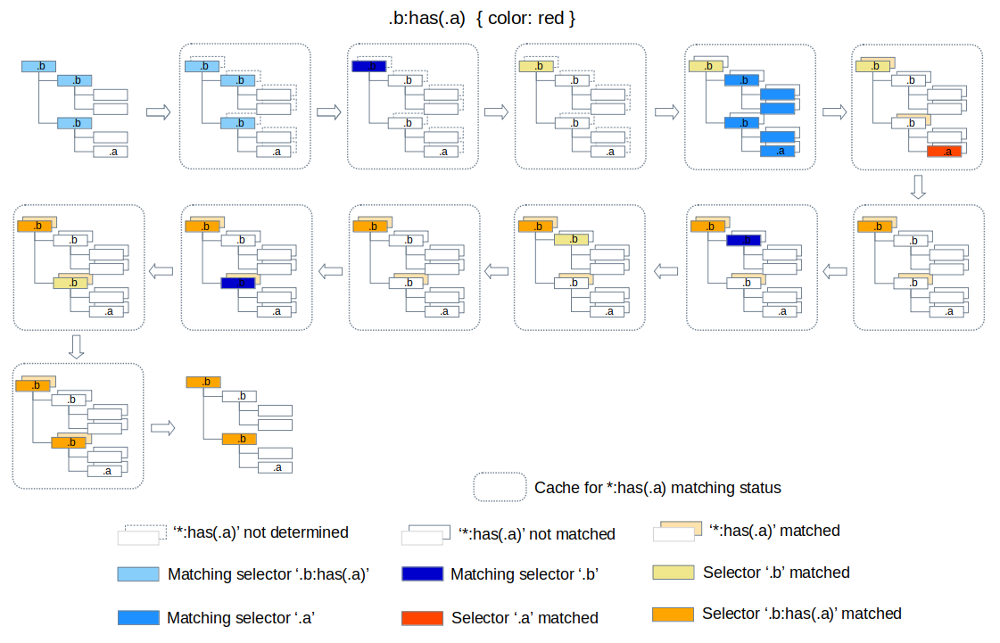

# :has() Style Recalculation

## 1. :has() pseudo class

`:has()` pseudo class is specified in the [4.5. The Relational Pseudo-class: ':has()'](https://www.w3.org/TR/selectors-4/#relational) section of the [Selector Level 4](https://www.w3.org/TR/selectors-4) as below.

> The relational pseudo-class, `:has()`, is a functional pseudo-class taking a relative selector list as an argument.

> It represents an element if any of the relative selectors, when absolutized and evaluated with the element as the :scope elements, would match at least one element.

According to the spec, the `:has()` selector takes [relative selector](https://www.w3.org/TR/selectors-4/#relative-selector) list as an argument, so supports following cases as the spec shows.
 * a:has(> img) : Matches only `<a>` elements that contain an `` child
 * dt:has(+ dt) : Matches a `<dt>` element immediately followed by another `<dt>` element

## 2. Matching :has() pseudo class

To determine whether an element matches a `:has()` pseudo class or not, the style engine needs to match the argument of the `:has()` on the downward subtree of the element.

## 3. Repetitive argument matching while style recalculation

During the [style recalculation process](blink-css-style-invalidation.md#2-the-style-invalidation-and-style-recalculation), a selector in a style rule will be matched on style invalid elements in a DOM to determine whether the style rule need to be applied to compute the style of the element.

The `:has()` pseudo class matching operation in the style recalculation process has a performance issue of repetitive argument matching a downward subtree of a subject element contains additional subject elements.

We can prevent the repetitive argument matching operations by caching the :has matching result. You can get the details from [the previous document](https://docs.google.com/document/d/1pk9rGRoxZ-axaf9OEeQ0Wk7SBebhpC-WUIw1-czmxt0/edit#heading=h.d6oztpar5hb8) about `:has` matching prototyping.

