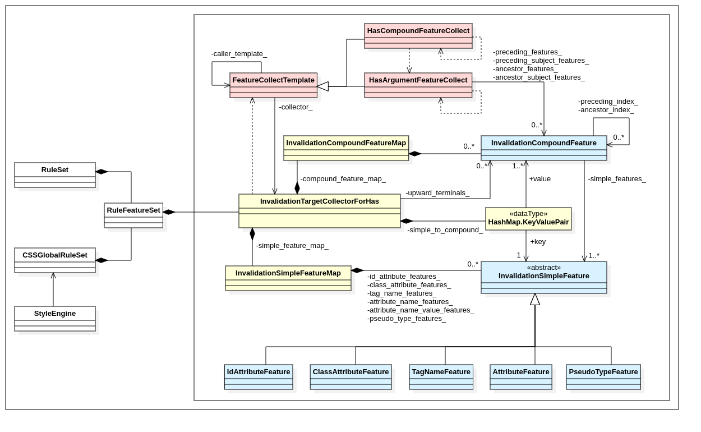
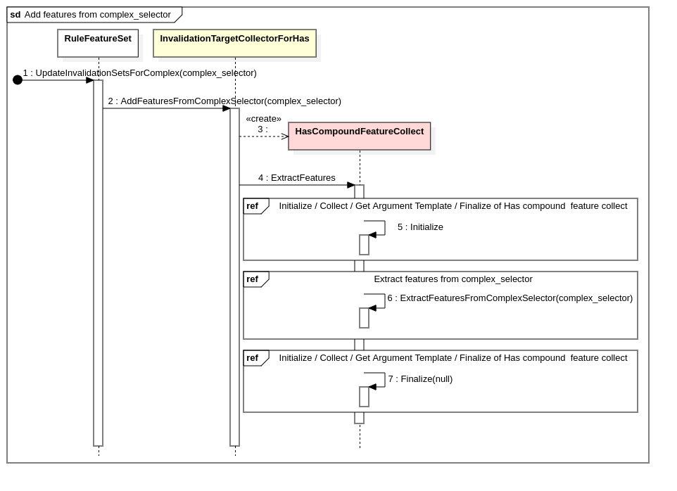

# :has() style Invalidation prototyping details

CL: <a href="https://chromium-review.googlesource.com/c/chromium/src/+/2725907" target="_blank">https://chromium-review.googlesource.com/c/chromium/src/+/2725907</a>

Binary: <a href="https://cloud.igalia.com/s/roLob25tsTzdKTa" target="_blink">https://cloud.igalia.com/s/roLob25tsTzdKTa</a>

## 1. Diagrams

### 1.1. Class Diagram

### 1.2. Sequence Diagram

#### 1.2.1. Collect features from selector

##### 1.2.1.1. Add features from \<complex-selector>

##### 1.2.1.2. Extract features from \<complex-selector>

##### 1.2.1.3. Ensure simple feature

##### 1.2.1.4. Ensure compound feature

##### 1.2.1.5. Extract argument features from downward / upward selectors

##### 1.2.1.6. Initialize / Collect / Finalize of downward invalidation

##### 1.2.1.7. Initialize / Collect / Finalize of upward invalidation

##### 1.2.1.8. Index features

#### 1.2.2. Find target elements of change and invalidate those

##### 1.2.2.1. Invalidate for Id changed

##### 1.2.2.2. Check upward subtree of changed element

##### 1.2.2.3. InvalidateDownward
