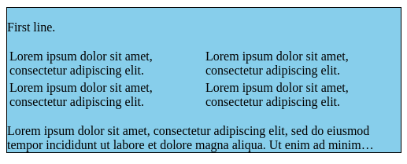
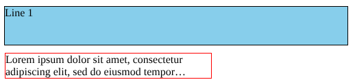
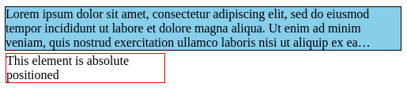

# Explainer: Limiting Visible Lines: line-clamp

- Contents:
  - [Authors](#authors)
  - [Introduction](#introduction)
  - [Risks](#risks)
  - [Implementation](#risks)
  - [Examples](#risks)

## Authors

* Andreu Botella \<abotella@igalia.com\>
* Javier Fernandez \<jfernandez@igalia.com\>

## Introduction

The line-clamp feature allows clamping a block element to have at most a specific number of text lines, or to have as many lines as will fit in a certain height, showing an ellipsis at the end of the last line to indicate that there is clamped content after it.

Setting the `line-clamp: 3` property on a block element that contains more than three lines of text will cause it to not show any text after the third line and to display an ellipsis at the end of the third line. The hidden lines do not count for computing the element's height, and they are hidden regardless of the value of the `overflow` property. If the element would normally contain three or fewer lines, then this property would have no effect.

This property can also be used to clamp based on a given height, rather than on a number of lines. When `line-clamp` is set together with a value for `height` or `max-height`, it will clamp the element's contents so that they don't overflow the given height. If used together with a number of lines, this will result in clamping by either that many lines or a height, whichever comes earlier. But it is possible to clamp only by a height, with `line-clamp: auto`.

### Context

The `line-clamp` property is part of the CSS Overflow Level 4 specification. It is defined as a shorthand of 3 CSS properties:  [`continue`](https://drafts.csswg.org/css-overflow-4/#continue), [`max-lines`](https://drafts.csswg.org/css-overflow-4/#max-lines) and [`block-ellipsis`](https://drafts.csswg.org/css-overflow-4/#block-ellipsis).

Until April 2025, `line-clamp` was defined in the spec in terms of fragmentation (the mechanism that powers printing web content across multiple pages, as well as multi-column layout), where rather than creating a new page or column after the first one ends, the remaining content is discarded. However, this was different enough from the existing implementation of `-webkit-line-clamp` in all browsers, and implementing this new behavior currently does not seem to be possible without significant engineering effort.

Therefore, a new way of defining this feature was added to the spec, which is known as the “collapse variant”. This variant differs from the fragmentation-based “discard variant” in the following aspects:

- Rather than being based on fragmentation, it is based on not painting the clamped content (as if it had `visibility: hidden`), and letting it overflow the container.
- Any lines, block elements and floats after the clamp point are not painted. Additionally, when they overflow the element with the `line-clamp` property, they do not cause scrollbars to appear in its containers.
- Absolute positioned elements are always painted, regardless of where they are in the DOM order or in their visual position, unless their containing block (e.g. the closest `position: relative` ancestor) is fully after the clamp point.
- Floats before the clamp point are shown, but they are clipped to the line-clamp container's content box.

Currently both of these variants are defined in the specification, with the `collapse` and `discard` keywords of the `continue` property. However, the `line-clamp` shorthand will set `continue: collapse`, and it is not expected for browsers to support `continue: discard` anytime soon.

## Motivation

The functionality to clamp a block element to a number of lines and show an ellipsis at the end was previously already available through `-webkit-line-clamp`. This property, however, had a number of shortcomings. For instance, it relied on two other deprecated properties for it to work (`display: -webkit-box` and `-webkit-box-orient: vertical`), it required `overflow: hidden` to be present so the clamped lines would be hidden, and it also only allowed clamping based on a number of lines, not a height.

The existing `-webkit-line-clamp` seems to be a pain point for web developers, as can be seen in the blog post [“CSS Line-Clamp — The Good, the Bad and the Straight-up Broken”](https://medium.com/mofed/css-line-clamp-the-good-the-bad-and-the-straight-up-broken-865413f16e5). Furthermore, a Chrome use counter shows that uses of `-webkit-line-clamp` without the other properties that are needed for it to work [are at 3-4%](https://chromestatus.com/metrics/feature/timeline/popularity/3327), showing significant misuse in the wild. Given this, it makes sense to implement a version without these fallbacks.

## Risks

*(This section was written in February 2024, and things have changed significantly since then. See the update at the end of the section.)*

There is an ongoing discussion inside the CSSWG on whether this feature would be implemented on top of the [fragmentation model](https://drafts.csswg.org/css-break-4/#fragmentation-model), based on the concent of fragmentation of overflow defined in the CSS Overflow spec and the [continue: discard](https://drafts.csswg.org/css-overflow-4/#valdef-continue-discard) property, or based on hiding content from paint.

Even though the fragmentation approach would allow generalizing fragmentation of overflow into something similar to CSS Regions that solves some of its drawbacks, it requires changing the implementation of fragmentation in browser engines to support discarding fragments. Considering that the original `-webkit-line-clamp` doesn't involve fragmentation at all, it would seem that the “collapse approach” might make more sense at this stage.

In terms of interoperability, the collapse approach also seems like a better idea. The discard variant would not be easy to implement in Gecko and WebKit, given their fragmentation models, and that could imply delaying the implementation of this feature by a few years.

On the other hand, the collapse variant as currently proposed would result in out of flow content (i.e. floating and positioned elements) not being clamped, and perhaps even appearing entirely outside of the `line-clamp` element's content area, even though no in-flow content is shown. The discard variant does not have this issue, since out of flow content also fragments. There is currently no specification text for this variant, however, and this could still be solved satisfatorily. (See this [CSSWG comment](https://github.com/w3c/csswg-drafts/issues/7708#issuecomment-1274127954) and the rest of the issue for more details.)

**Update as of September 2025:** The CSS Working Group has resolved to use the `continue: collapse` model based on hiding content from paint, which is described by this document. The fragmentation model is still in the CSS Overflow Level 4 specification, but [there is an open issue to mark it as "at risk"](https://github.com/w3c/csswg-drafts/issues/12795), meaning that implementations don't need to support it. The `continue: collapse` variant has been specified, and the open questions have been satisfactorily solved. This explainer has been updated to reflect the current spec text.

## Implementation

The “collapse approach” of the line-clamp feature can be implemented on top of the already supported `-webkit-line-clamp` property, so in terms of implementation complexity it's the best solution for the 3 major web engines.

The `line-clamp` property is a shorthand for three other properties, and its syntax is:

    none | [ <integer [1,inf]> || <'block-ellipsis'> ]

Common values would be:

- `line-clamp: none`. This is the initial value, which disables line clamping.
- `line-clamp: 3`. Clamps to 3 lines.
- `line-clamp: auto`. Clamps to whatever content fits the specified height constraints (e.g. `max-height`), if any. (`auto` is a keyword of the `block-ellipsis` property.)
- `line-clamp: 3 no-ellipsis`. Clamps to 3 lines, but makes the third line not show an ellipsis.

This is a shorthand for these three longhand properties:

- `continue` is the property that enables the clamping behavior. Its values are `auto` (don't clamp), and `collapse` (do clamp, using the model based on hiding lines).
- `max-lines` sets a maximum number of lines to clamp at. It can be a positive integer, or `none`.
- `block-ellipsis` defines whether the line before clamp has an ellipsis. Its values are `auto` (use a regular ellipsis `…`), `no-ellipsis` (don't ellipsize), and a string value to use instead of an ellipsis.

Note that if you set `line-clamp: 3` together with `max-height`, it will clamp to either 3 lines, or to the height, if that is less than that. `line-clamp: auto` removes the lines restriction, so it sets `max-lines: none`.

### Backward compatibility

In order to ensure the compatibility with the prefixed `-webkit-line-clamp`, the spec text defines that as a shorthand of the same properties as `line-clamp`, allowing only `none` or an integer as its syntax.

However, due to web compatibility, `-webkit-line-clamp` must not work without `display: -webkit-box` and `-webkit-box-orient: vertical`, but we do want `line-clamp` to be able to work without those. To achieve this, we add a new keyword to the `continue` longhand called `-webkit-legacy` that behaves like `collapse` only if those properties are set, and which `-webkit-line-clamp` sets instead of `collapse`. This keyword should not be used by developers, and hopefully it can be removed, along with the `-webkit-line-clamp` special behavior, over time.

Since `line-clamp: 3` and `-webkit-line-clamp: 3` are both shorthands for the same properties, but they don't behave identially, whichever is set later in cascade order wins. If `line-clamp: 3` is set on a selector with a lower specificity than one where `-webkit-line-clamp: 3` is set for the same element, the `-webkit-line-clamp` behavior will apply, and the `display: -webkit-box` and `-webkit-box-orient: vertical` properties will be needed.

Aside from needing these two other properties, the spec currently says that `-webkit-line-clamp` should behave just like `line-clamp`. However, in some cases, the behavior for `line-clamp` is known to be different from the `-webkit-line-clamp` behavior in some or all of the implementations. For example, content after the clamp point should be hidden in `line-clamp` regardless of whether `overflow: hidden` is set, but that is not the case in any of the legacy implementations for `-webkit-line-clamp`. Aligning the behavior with `line-clamp` could cause web compatibility issues, in which case we would try to keep as much alignment with the unprefixed property as possible.

## Examples

Given the following text element:

```html
<div id="clamped">
  Lorem ipsum dolor sit amet, consectetur adipiscing elit, sed do eiusmod tempor incididunt ut labore et dolore magna aliqua. Ut enim ad minim veniam, quis nostrud exercitation ullamco laboris nisi ut aliquip ex ea commodo consequat. Duis aute irure dolor in reprehenderit in voluptate velit esse cillum dolore eu fugiat nulla pariatur. Excepteur sint occaecat cupidatat non proident, sunt in culpa qui officia deserunt mollit anim id est laborum.
</div>
```

and this existing CSS stylesheet:

```css
#clamped {
  border: 1px solid black;
  background-color: skyblue;
  width: 500px;
}
```

### Example 1: Setting a maximum number of lines

```css
#clamped {
  line-clamp: 3;
}
```


### Example 2: Setting a maximum height

```css
#clamped {
  line-clamp: auto;
  max-height: 75px;
}
```


### Example 3: Clamping based on an animating height

```css
#clamped {
  line-clamp: auto;
  animation: 3s height-animation linear infinite alternate;
}

@keyframes height-animation {
  from {
    height: 140px;
  }

  to {
    height: 0;
  }
}
```


### Example 4: Interaction with non-text content (i.e. a table)

```css
#clamped {
  line-clamp: 3;
}
```

```html
<div id="clamped">
    <div>First line.</div>

    <table>
        <tr>
            <td>Lorem ipsum dolor sit amet, consectetur adipiscing elit.</td>
            <td>Lorem ipsum dolor sit amet, consectetur adipiscing elit.</td>
        </tr>
        <tr>
            <td>Lorem ipsum dolor sit amet, consectetur adipiscing elit.</td>
            <td>Lorem ipsum dolor sit amet, consectetur adipiscing elit.</td>
        </tr>
    </table>

    <div>Lorem ipsum ....</div>
</div>
```



### Example 5: Interaction with float elements

```css
#clamped {
  line-clamp: 3;
}

#float {
  width: 45px;
  float: right;
  border: 1px solid red;
  font-size: .85em;
}
```

```html
<div id="clamped">
  <div id="float">This element is a float</div>
  Lorem ipsum ....
</div>
```


```html
<div id="clamped">
  Lorem ipsum ....
  <div id="float">This element is a float</div>
</div>
```


### Example 6: Interaction with relative positioned elements

```css
#clamped {
  line-clamp: 3;
}

#relpos {
  width: 300px;
  position: relative;
  top: 70px;
  border: 1px solid red;
}
```

```html
<div id="clamped">
    <div id="relpos">This element is relative positioned</div>
    Lorem ipsum ....
</div>
```


```css
#clamped {
  line-clamp: 3;
}

#relpos {
  width: 300px;
  position: relative;
  top: 50px;
  border: 1px solid red;
}
```

```html
<div id="clamped">
    Line 1
    <div id="relpos">Lorem ipsum ....</div>
</div>
```



```css
#clamped {
  line-clamp: 3;
}

#relpos {
  width: 300px;
  position: relative;
  top: -100px;
  border: 1px solid red;
}
```

```html
<div id="clamped">
  Lorem ipsum ....
  <div id="relpos">This element is relative positioned</div>
</div>
```


### Example 7: Interaction with absolute positioned elements


```css
#abspos {
  width: 200px;
  position: absolute;
  top: 75px;
  border: 1px solid red;
}
```

```html
<div id="clamped">
  <div id="abspos">This element is absolute positioned</div>
  Lorem ipsum ....
</div>
```



```html
<div id="clamped">
  Lorem ipsum ....
  <div id="abspos">This element is absolute positioned</div>
</div>
```


```css
#relpos {
  position: relative;
}
```

```html
<div id="clamped">
  Lorem ipsum ....
  <div id="relpos">
    <div id="abspos">This element is absolute positioned</div>
  </div>
</div>
```

