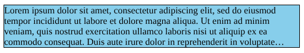

# Explainer: Limiting Visible Lines: line-clamp

- Contents:
  - [Authors](#authors)
  - [Introduction](#introduction)
  - [Risks](#risks)
  - [Implementation](#risks)
  - [Examples](#risks)

## Authors

* Andreu Botella \<abotella@igalia.com\>
* Javier Fernandez \<jfernandez@igalia.com\>

## Introduction

The line-clamp feature allows clamping a block element to have at most a specific number of text lines, or to have as many lines as will fit in a certain height, showing an ellipsis at the end of the last line to indicate there is clamped content after it.

Setting the `line-clamp: 3` property on a block element that contains more than three lines of text will cause it to not show any text after the third line and to display an ellipsis at the end of the third line. The hidden lines do not count for computing the element's height, and they are hidden regardless of the value of the `overflow` property. If the element would normally contain three or fewer lines, then this property would have no effect.

This property can also be used in a way that clamps based on a given height, rather than a number of lines. Setting `line-clamp: auto` on a block element with a set value for `height` or `max-height` other than `auto` will clamp the element's text lines so that they don't overflow the given height, with a minimum of one line shown. The clamping behavior is otherwise identical to `line-clamp` used with a number.

### Context

The `line-clamp` property is part of the CSS Overflow Level 4 specification. The way it is currently defined in the spec, it is based on fragmentation (the mechanism that powers printing web content across multiple pages, as well as multi-column layout), where rather than creating a new page or column after the first one ends, the remaining content is discarded.

In the spec, `line-clamp` is defined as a shorthand of 3 CSS properties:  [`continue`](https://drafts.csswg.org/css-overflow-4/#continue), [`max-lines`](https://drafts.csswg.org/css-overflow-4/#max-lines) and [`block-ellipsis`](https://drafts.csswg.org/css-overflow-4/#block-ellipsis).

There is also an [issue](https://github.com/w3c/csswg-drafts/issues/7708) of the CSS Overflow spec to discuss an alternative way of implementing the feature, which is known as the “collapse variant” (a.k.a. `continue: collapse`). This variant differs from the “discard variant” in the following aspects:

- Rather than being based on fragmentation, it is based on not painting the clamped content (as if it had `visibility: hidden`), and letting it overflow the container.
- Any lines, block elements, floats and positioned elements after the clamp point are not painted. Additionally, when they overflow the element with the `line-clamp` property, they do not cause scrollbars to appear in its containers.
- Out of flow content (i.e. floats and positioned elements) before the clamp point are shown in its entirety, even though they might overflow the container. (This is still pending to be discussed in detail in the CSSWG, though.)

## Motivation

The functionality to clamp a block element to a number of lines and show an ellipsis at the end was previously already available through `-webkit-line-clamp`. This property, however, had a number of shortcomings. For instance, it relied on two other deprecated properties for it to work (`display: -webkit-box` and `-webkit-box-orient: vertical`), it required `overflow: hidden` to be present so the clamped lines would be hidden, and it also only allowed clamping based on a number of lines, not a height.

The existing `-webkit-line-clamp` seems to be a pain point for web developers, as can be seen in the blog post [“CSS Line-Clamp — The Good, the Bad and the Straight-up Broken”](https://medium.com/mofed/css-line-clamp-the-good-the-bad-and-the-straight-up-broken-865413f16e5). Furthermore, a Chrome use counter shows that uses of `-webkit-line-clamp` without the other properties that are needed for it to work [are at 3-4%](https://chromestatus.com/metrics/feature/timeline/popularity/3327), showing significant misuse in the wild. Given this, it makes sense to implement a version without these fallbacks.

## Risks

There is an ongoing discussion inside the CSSWG on whether this feature would be implemented on top of the [fragmentation model](https://drafts.csswg.org/css-break-4/#fragmentation-model), based on the concent of fragmentation of overflow defined in the CSS Overflow spec and the [continue: discard](https://drafts.csswg.org/css-overflow-4/#valdef-continue-discard) property, or based on hiding content from paint.

Even though the fragmentation approach would allow generalizing fragmentation of overflow into something similar to CSS Regions that solves some of its drawbacks, it requires changing the implementation of fragmentation in browser engines to support discarding fragments. Considering that the original `-webkit-line-clamp` doesn't involve fragmentation at all, it would seem that the “collapse approach” might make more sense at this stage.

In terms of interoperability, the collapse approach also seems like a better idea. The discard variant would not be easy to implement in Gecko and WebKit, given their fragmentation models, and that could imply delaying the implementation of this feature by a few years.

On the other hand, the collapse variant as currently proposed would result in out of flow content (i.e. floating and positioned elements) not being clamped, and perhaps even appearing entirely outside of the `line-clamp` element's content area, even though no in-flow content is shown. The discard variant does not have this issue, since out of flow content also fragments. There is currently no specification text for this variant, however, and this could still be solved satisfatorily. (See this [CSSWG comment](https://github.com/w3c/csswg-drafts/issues/7708#issuecomment-1274127954) and the rest of the issue for more details.)

## Implementation

The “collapse approach” of the line-clamp feature can be implemented on top of the already supported `-webkit-line-clamp` property, so in terms of implementation complexity it's the best solution for the 3 major web engines.

Since it doesn't require fragmentation, we could implementing the feature as a simple longhand property, instead of a shorthand of 3 new properties as defined in the current spec. The syntax would as follows:

 	`none | auto | <integer [1,inf]>`

The `auto` value is [proposed](https://github.com/w3c/csswg-drafts/issues/9368) as a possible value for the new `max-lines` property, which an eventual `line-clamp` shorthand will manage. When using this value, the number of lines will be determined according to the value of the `max-height` property.

### Backward compatibility

In order to ensure the compatibility with the prefixed `-webkit-line-clamp`, the current spec draft [proposes](https://drafts.csswg.org/css-overflow-4/#propdef--webkit-line-clamp) to define it as a shorthand of the same properties the new `line-clamp` is handling, but introducing special values for the deprecated ```display: -webkit-box``` and ```continue: -webkit-discard```

Alternatively, given that the implementation of the “collapse approach” proposed here relies on the code of the prefixed property, we could define it as an alias of the new `line-clamp` shorthand.

## Examples

Given the following text element:

```html
<div id="clamped">
  Lorem ipsum dolor sit amet, consectetur adipiscing elit, sed do eiusmod tempor incididunt ut labore et dolore magna aliqua. Ut enim ad minim veniam, quis nostrud exercitation ullamco laboris nisi ut aliquip ex ea commodo consequat. Duis aute irure dolor in reprehenderit in voluptate velit esse cillum dolore eu fugiat nulla pariatur. Excepteur sint occaecat cupidatat non proident, sunt in culpa qui officia deserunt mollit anim id est laborum.
</div>
```

### Example 1: Setting a maximum number of lines

```css
#clamped {
  border: 1px solid black;
  background-color: skyblue;
  width: 500px;

  line-clamp: 3;
}
```


### Example 2: Setting a maximum height

```css
#clamped {
  border: 1px solid black;
  background-color: skyblue;
  width: 500px;
  max-height: 75px:

  line-clamp: auto;
}
```



### Example 3: Interaction with non-text content (i.e. a table)

```html
<div id="clamped">
    <p>First line.</p>

    <table>
        <tr>
            <td>Lorem ipsum dolor sit amet, consectetur adipiscing elit.</td>
            <td>Lorem ipsum dolor sit amet, consectetur adipiscing elit.</td>
        </tr>
        <tr>
            <td>Lorem ipsum dolor sit amet, consectetur adipiscing elit.</td>
            <td>Lorem ipsum dolor sit amet, consectetur adipiscing elit.</td>
        </tr>
    </table>

    <p>Lorem ipsum ....</p>
</div>
```


### Example 4: Interaction with float elements

*(These screenshots are according to the collapse variant, and this behavior is still pending discussion by the CSSWG.)*

```css
#float {
  width: 50px;
  float: right;
  border: 1px solid red;
}
```

```html
<div id="clamped">
  <div id="float">This element is a float</div>
  Lorem ipsum ....
</div>
```


```html
<div id="clamped">
  Lorem ipsum ....
  <div id="float">This element is a float</div>
</div>
```


### Example 5: Interaction with relative positioned elements

*(These screenshots are according to the collapse variant, and this behavior is still pending discussion by the CSSWG.)*

```html
<style>
  #relpos {
    width: 300px;
    position: relative;
    top: 100px;
    border: 1px solid red;
  }
</style>

<div id="clamped">
    <div id="relpos">This element is relative positioned</div>
    Lorem ipsum ....
</div>
```


```html
<style>
  #relpos {
    width: 300px;
    position: relative;
    top: -100px;
    border: 1px solid red;
  }
</style>

<div id="clamped">
  Lorem ipsum ....
  <div id="relpos">This element is relative positioned</div>
</div>
```


### Example 6: Interaction with absolute positioned elements

*(These screenshots are according to the collapse variant, and this behavior is still pending discussion by the CSSWG.)*

```css
#abspos {
  width: 200px;
  position: absolute;
  top: 75px;
  border: 1px solid red;
}
```

```html
<div id="clamped">
  <div id="abspos">This element is absolute positioned</div>
  Lorem ipsum ....
</div>
```


```html
<div id="clamped">
  Lorem ipsum ....
  <div id="abspos">This element is absolute positioned</div>
</div>
```


