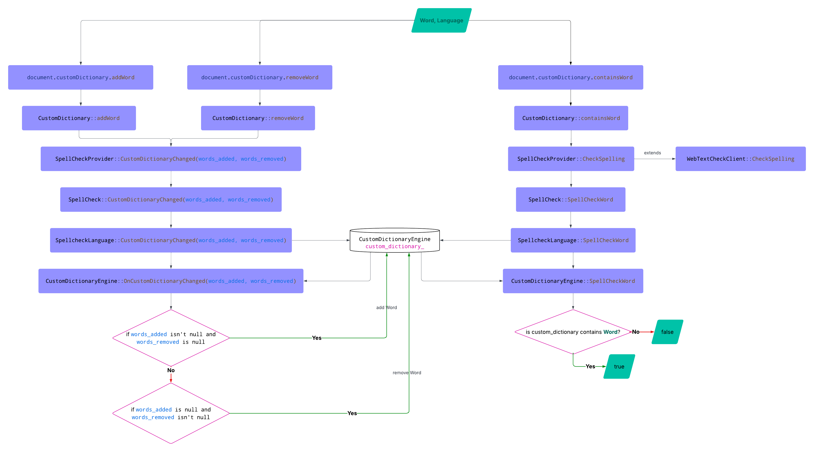

# Explainer: API for handling the Document Local Dictionary

- Contents:
  - [Authors](#authors)
  - [Introduction](#introduction)
  - [Motivation](#motivation)
  - [Proposal](#proposal)
  - [Security and Privacy Considerations](#security)
  - [Future Work](#future)
  - [Discussion](#discuss)

## <a name="authors"></a> Authors

* Jihye Hong \<jihye@igalia.com\>

## <a name="introduction"></a> Introduction

The proposed APIs enable users to modify the document local dictionary in the browser. Users can add, remove, and check words in the document local dictionary.
This feature ensures that the browser does not mark words in the document local dictionary as spelling errors.

The document local dictionary mentioned here differs from the browser's custom dictionary. 
The browser process manages the browser's custom dictionary, which the user can modify via the Chrome browser's settings panel.
The renderer process manages the document local dictionary.

## <a name="motivation"></a> Motivation

Some words need to be added to the document local dictionary so that the browser does not mark them as spelling errors.

Some websites focus on specific topics. For instance, 
- A website dedicated to Pokémon might feature the names of various Pokémon characters, such as Pikachu and Charmander.
- A website that provides information about South Korea and may include Korean words or terms presented in English pronunciation.
- A website related to analyzing economic market status would include the terminology related to the company's names and products

Specific words shouldn't be presented as spelling errors in the cases above.
It needs to be possible to remove added words if they become unnecessary.

Current specs such as [`element.spellcheck` attribute](https://html.spec.whatwg.org/multipage/interaction.html#attr-spellcheck) and [`::spelling-error` CSS pseudo-element](https://drafts.csswg.org/css-pseudo/#selectordef-spelling-error) manage the words already in the dictionary.
Therefore, a new API is needed to manipulate the document local dictionary.

In addition, usage of the document local dictionary will improve the functionality of [Proofreader API](https://github.com/webmachinelearning/proofreader-api?tab=readme-ov-file#proofreader-api-explainer), which can find and correct errors such as grammar, spelling, and punctuation to generate an error-free text before it is published or shared. Proofreading behaviour can be more efficient by skipping specific words as they are present in the document local dictionary.

## <a name="proposal"></a> Proposal

### Syntax
```
User agents must create a Dictionary object whenever a document is created and associate the object with that document.

[Exposed=Window]
interface Document : Node {
  constructor();

   ...

  [SameObject] readonly attribute Dictionary dictionary;
};

[Exposed=Window]
interface Dictionary {
  undefined add(DOMString word, DOMString language);
  undefined delete(DOMString word, DOMString language);
  boolean has(DOMString word, DOMString language);
};
```
- `add()` adds a word to the document local dictionary
- `delete()` deletes a word from the document local dictionary
- `has()` returns `true` if the passed word is already present in the document local dictionary; otherwise `false`

### High-level Architecture


### Data Storage

The document local dictionary data is managed in the format of `std::set<std::u16string>`, which is defined in [CustomDictionaryEngine](https://source.chromium.org/chromium/chromium/src/+/main:components/spellcheck/renderer/custom_dictionary_engine.h;l=14;bpv=1;bpt=1?q=custom_dictionary%20engine&ss=chromium).
It is defined per a `Document` object.

`document.dictionary.add` or `document.dictionary.delete` triggers [`CustomDictionaryEngine::OnCustomDictionaryChanged`](https://source.chromium.org/chromium/chromium/src/+/main:components/spellcheck/renderer/custom_dictionary_engine.cc;bpv=1;bpt=1) to insert or erase a word via `std::set<std::u16string>` type of the local dictionary.

### Example

#### Example 1. Manipulating the document local dictionary
```js

// Add a word to the dictionary
document.dictionary.add("IRL", "en-GB");
document.dictionary.add("TBH", "en-GB");

// Delete a word from the dictionary
document.dictionary.delete("TBH", "en-GB");
```

#### Example 2. Adding a new proper noun
```js

// Add a word to the dictionary
document.dictionary.add("Pikachu", navigator.language);

```

## <a name="security"></a> Security and Privacy Considerations
The document local dictionary data won't be loaded cross-origin. To implement this feature, user agents must use the potentially [CORS-enabled fetch method](https://fetch.spec.whatwg.org/#http-cors-protocol).
Also, non-persistent browser sessions must manage data related to the document local dictionary.

## <a name="future"></a> Future Work
### Persistently store data
In terms of site optimization, persistently saving document local dictionary data would allow sites to have large dictionaries without set-up costs and the bandwidth to transmit dictionaries on every load.
Also, it's helpful when Internet connections are flaky or non-existent.
Using a scheme such as IndexedDB is under consideration.

### Complementary implementation approach to provide a downloadable server URL for dictionary files

Referring to [Electron's built-in support for Chromium's spellchecker](https://www.electronjs.org/docs/latest/tutorial/spellchecker), document local dictionary can be implemented by providing a dictionary server URL in the HTML header.

Compared to Chromium's spellchecker, this approach gives a flexible, efficient way to fetch dictionaries.
Therefore, it can be beneficial for performance, deployment, and privacy needs as below:

1. Efficient fetching of dictionary files
Chromium's spellchecker downloads the default hunspell dictionary files from a Google CDN by default. In this approach, the HTML header can tell where to download dictionary files from when needed. 

2. Light-weight storage for dictionary data
Keeping dictionaries for every language would be massive. By fetching only the dictionaries needed at runtime, you keep the storage size minimal and only download content as required.

3. Flexibility of using dictionary data
This approach allows developers to avoid downloading the default hunspell dictionary files, so they can only use document local dictionary.

4. Security and Privacy
By default, custom words are stored as plain text, which raises privacy risks. When adopting packages like [@standardnotes/electron-secure-spellchecker](https://www.npmjs.com/package/%40standardnotes/electron-secure-spellchecker), which encrypts custom words using [Electron’s safeStorage](https://www.electronjs.org/docs/latest/api/safe-storage), this approach can improve privacy matters.

## <a name="discuss"></a> Discussion
