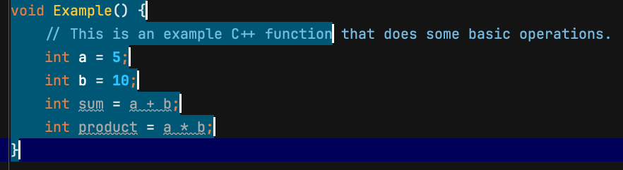

# Explainer: `document.nodesFromRect()` function

## Authors:

- [Luke Warlow](https://github.com/lukewarlow) <[lwarlow@igalia.com](mailto:lwarlow@igalia.com)>

## Participate
- [CSSWG Issue](https://github.com/w3c/csswg-drafts/issues/11605)

## Table of Contents

- [Introduction](#Introduction)
- [User-Facing Problem](#User-Facing-Problem)
- [Goals](#Goals)
- [Non-Goals](#Non-Goals)
- [Proposed Approach](#Proposed-Approach)
- [Accessibility, Privacy, and Security Considerations](#Accessibility-Privacy-and-Security-Considerations)

## Introduction

This feature's goal is to provide web developers the ability to get access to content within a specific area of a web page. This is useful for creating custom interaction models beyond those provided by browsers. While this is possible today, the solutions are limited and require heavy lifting from developers.

To meet this goal, it is proposed that a new `document.nodesFromRect()` function be exposed. This would return all DOM nodes that intersect a given rectangle.

- This document's status: Active
- Expected venue and specification: CSSWG's [CSSOM View Module](https://drafts.csswg.org/cssom-view/#extensions-to-the-document-interface)

## User-Facing Problem

Browsers provide a variety of built-in interaction modes for HTML content. However, there are use cases where these built-ins aren't enough: for example, the browser’s selection mechanism only works in the text-flow direction.

In certain contexts, users want to interact with content in more specialised ways. A common example is the ability to select an area of the screen to interact with a grouping of content (e.g. to copy it or to move its position).

Example custom selection UIs in Web Apps:
- Figma uses and renders a rectangle.
  
- VSCode uses a rectangular selection but renders line highlights.
  


Example native apps with similar UIs:
- JetBrains IDEs use a rectangular selection but render line highlights.
  
- Firefox offers a custom selection mode for tables which could be approximated as a rectangle selection.
  

### Goals

- Expose information about DOM nodes (not just elements) that intersect with a rectangular region, in order to enable more advanced interaction models.

### Non-Goals

- Providing a solution to generate the input rectangle, such as the custom selection UI.
- Providing a solution to moving a grouping of DOM nodes.
- Providing a solution to copy content from elements to the clipboard.

## Proposed Approach

We propose adding a new `document.nodesFromRect()` function. This would take a rectangle (a [DOMRectInit](https://drafts.fxtf.org/geometry-1/#dictdef-domrectinit)) representing the area of a web page that can be queried for elements and text.

Note: Accepting a DOMRectInit means it can take a DOMRect, DOMRectReadOnly, or a plain object with the appropriate properties.

### Example copy table to clipboard

```js
async function process() {
    // Some author specific code for determining a rectangle, perhaps a custom selection UI using Pointer Events
    const rect = { x, y, width, height };
    await copyTableData(rect);
}

async function copyTableData(rect) {
    const nodesInRect = document.nodesFromRect(rect); /* **NEW API** */

    // Filter resulting nodes, e.g. getting table data and headers
    const cells = nodesInRect.filter(
        node => node.tagName === 'TD' || node.tagName === 'TH'
    );

    const rows = new Map();
    for (const cell of cells) {
        // Process cells to get text content into map
    }

    const markdown = /* build markdown string from rows map */;

    await navigator.clipboard.writeText(markdown);
}
```


### API Details

Extensions to the document Interface:

```webidl
partial interface Document {
    sequence<Node> nodesFromRect(DOMRectInit rect, optional NodesFromRectOptions options = {});
}

dictionary NodesFromRectOptions {
    sequence<ShadowRoot> shadowRoots = [];
}
```

- The `shadowRoots` option allows results to include nodes inside the provided shadow roots, enabling controlled Shadow DOM piercing.

Rough proposed algorithm:

1. Let *sequence* be a new empty sequence.
2. If rect isn't valid (such as negative coords or inverted rects), return sequence.
3. For each [box](https://drafts.csswg.org/css-display-4/#box) or [text sequence](https://drafts.csswg.org/css-display-4/#css-text-sequence) *item* in the [viewport](https://drafts.csswg.org/css2/#viewport%E2%91%A0), in paint order, starting with the topmost:
    - 3.1. If *item* is a text sequence:
        - 3.1.1. For each text node *node* in *item*'s text nodes:
            - 3.1.1.1. Let *range* be a new Range.
            - 3.1.1.2. [Select](https://dom.spec.whatwg.org/#concept-range-select) *node* within *range*.
            - 3.1.1.3. Let *bounding box* be the result of [getting the bounding box for *range*](https://drafts.csswg.org/cssom-view/#dom-range-getboundingclientrect).
            - 3.1.1.4. If *bounding box* intersects rect, append *node* to *sequence*. **Issue: Need to handle retargeting using options.shadowRoot.**
    - 3.2. Else:
        - 3.2.1. Let *element* be *items* associated element.
        - 3.2.2. Let *bounding box* be the result of [getting the bounding box for *element*](https://drafts.csswg.org/cssom-view-1/#element-get-the-bounding-box).
        - 3.2.3. If *bounding box* intersects rect, append *element* to *sequence*. **Issue: Need to handle retargeting using options.shadowRoot.**
4. Return sequence.

Questions?

- Do we need a "contained" boolean option to exclude nodes that intersect but aren't contained within the rect?
- Do we need a "tolerance" option, which when paired with "contained" would allow authors to get a filtered-down output without losing nodes that intersect very closely with the selection?

## Alternatives considered

### An advanced shape based API

In some applications, selection UI is more complex than a rectangular area, such as lasso selection tools. An API that handles more complex shapes for the query was considered but decided against (for this proposal) for two main reasons:
- The web doesn't currently have any primitives for representing these more complex shapes. See discussion to add a [DOMPolygon](https://github.com/w3c/fxtf-drafts/issues/603).
- Browsers don't have underlying mechanisms for doing this more advanced querying, so it would require more implementation effort compared to rect-based querying, which browsers already support.

### `document.elementsFromRect()`

The existing APIs in this area, namely `document.elementFromPoint()` and `document.elementsFromPoint()`, will only (as the names suggest) operate on Elements and **not** on Nodes. On the face of it, this is okay, but this runs into limitations which might not be desirable for this sort of feature. For example, text content slotted into a Shadow DOM isn't an Element, and so wouldn't be returned by an API scoped to Elements. This limitation was raised in https://github.com/w3c/csswg-drafts/issues/11605#issue-2819548585.


### `node.nodesFromRect()`

A possible addition is the ability to scope the query to a specific sub-tree of the document. This would allow the browser to do more of the filtering of the resultant nodes up-front and potentially allow optimisations such as doing sub-tree re-layout. This hasn't been ruled out and is currently considered to be an addition rather than an alternative.

## Accessibility, Privacy, and Security Considerations

### Accessibility Considerations

While some interaction models this function might be used within could be problematic for accessibility (e.g. a mouse based selection model with no keyboard alternative), the proposed method itself has no impact on accessibility.

### Privacy and Security Considerations

The proposed method doesn't expose anything not already available to website authors, it only makes it more ergonomic to access.

## Stakeholder Feedback / Opposition

TBD

## References & acknowledgements

This proposal arrives at the same conclusion as that of Emilio in [csswg-drafts#11605](https://github.com/w3c/csswg-drafts/issues/11605).

Requests for similar functionality:

- https://github.com/w3c/csswg-drafts/issues/10398
- https://stackoverflow.com/questions/4002059/get-dom-elements-inside-a-rectangle-area-of-a-page
- https://stackoverflow.com/questions/26259412/get-all-elements-touching-a-rectangle
- https://stackoverflow.com/questions/38235934/get-all-text-in-a-bounding-rectangle
